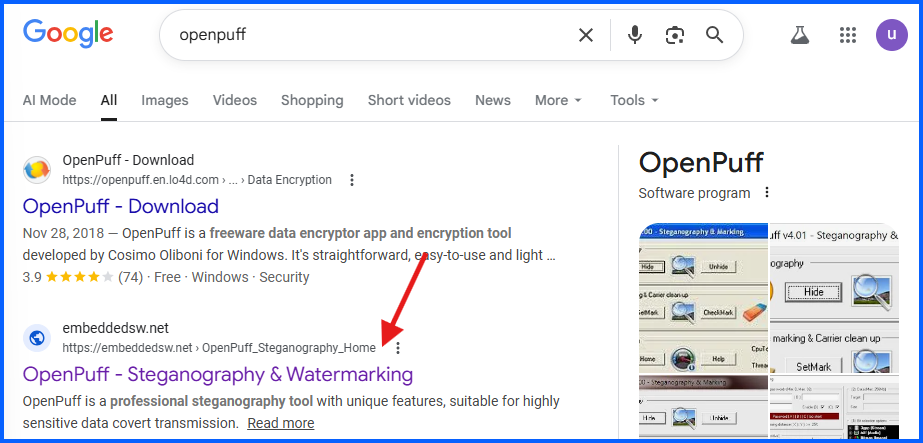
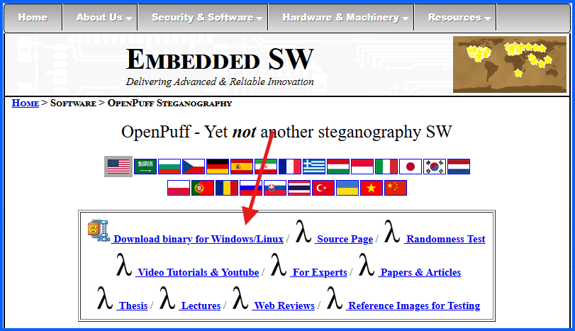
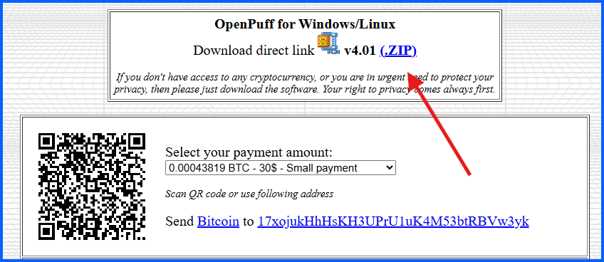
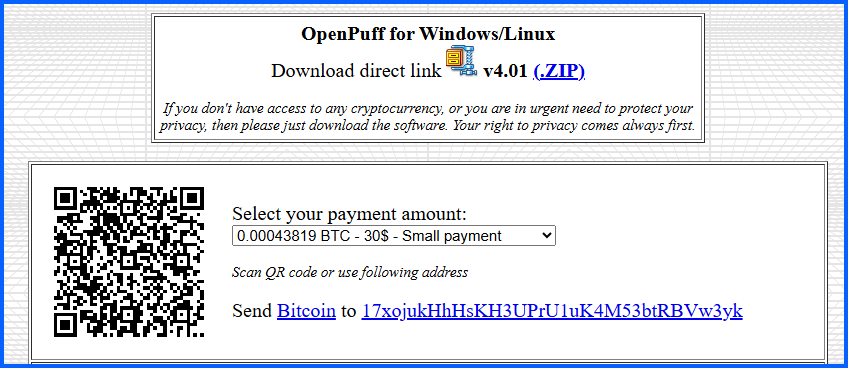
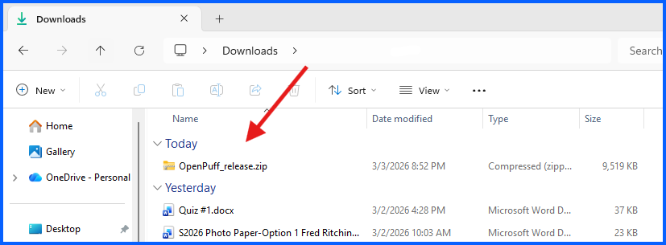
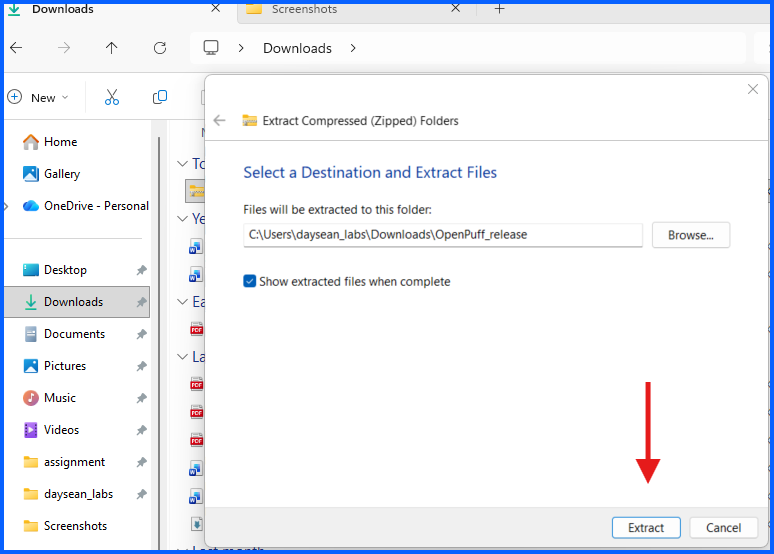
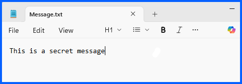
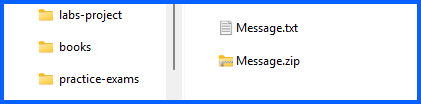
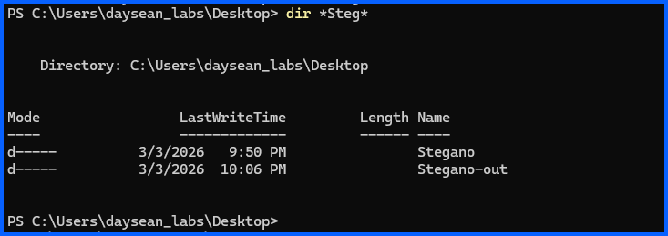

# Part A: Download and Setup OpenPuff

## Overview
In this section, I will download OpenPuff, set up the required files and folders, and prepare everything needed before hiding a secret message.

---


## Step 1: Download OpenPuff

1. Open your web browser and search for **OpenPuff**
2. Click on the result titled **OpenPuff - Steganography & Watermarking**




4. Click **Download binary for Windows/Linux**



6. When the payment page appears, click the **.ZIP link** to download for free without submitting a payment




---

## Step 2: Take a Screenshot (Carrier File)

1. Take a screenshot of the OpenPuff download page
2. Save it as **openPuff_Screenshot.jpg**, this will be the **carrier file** that will contain the hidden message




---

## Step 3: Extract OpenPuff

1. Navigate to your **Downloads** folder
2. Right-click on **OpenPuff_release.zip**
3. Click **Extract All**



5. Click **Extract**




---

## Step 4: Create the Secret Message

1. Open **Notepad**
2. Type the following:
   ```
   This is a secret message
   ```
3. Save the file as **Message.txt**
4. Close Notepad

**Note:** In lab/project I saved it to the **Desktop**



---

## Step 5: Zip the Message File

1. Navigate to the location of **Message.txt** (Desktop)
2. Right-click on **Message.txt**
3. Click **Compress to...**
4. Select **ZIP file**

You should now have both `Message.txt` and `Message.zip` in the same location.



---

## Step 6: Create Output Folders

Open **PowerShell** and run the following commands to create the two folders needed for this project:

```powershell
cd Desktop
mkdir Stegano
mkdir Stegano-out
```

- **Stegano** folder is where the carrier file with the hidden message will be saved
- **Stegano-out** fodler is where the recovered hidden message will be deposited




## Part A Complete

You have successfully:
- Downloaded and extracted OpenPuff
- Created a secret message and zipped it
- Created a `Stegano` and `Stegano-out` output folders

Continue to **[Part B: Hide Message with OpenPuff](./02-hide-message-with-OpenPuff.md)**
