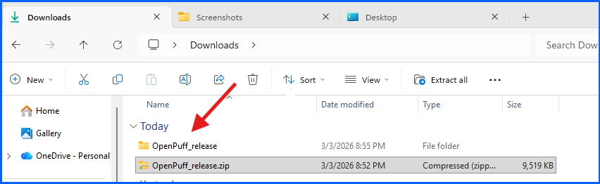
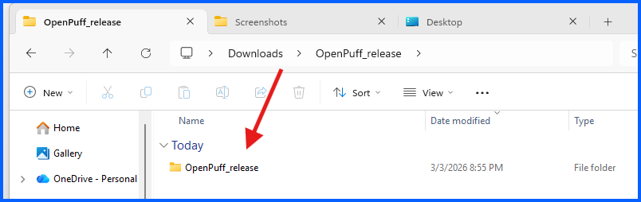
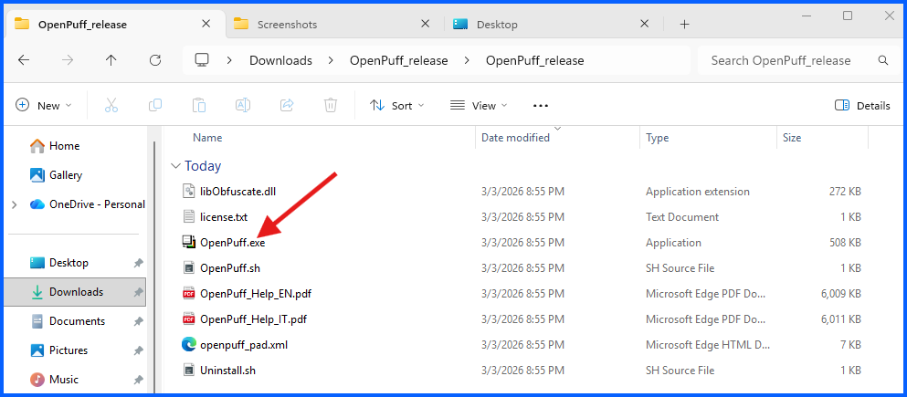
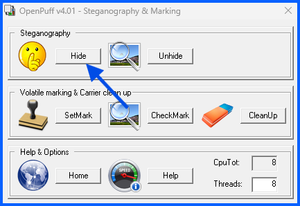

# Part B: Hide and Unhide Message

## Overview
In this section, I will use **OpenPuff** to embed a secret message inside a carrier image, then recover it using the Unhide feature.

---

## Part B-1: Hide the Message

### Step 1: Open OpenPuff and Click Hide

1. Navigate to your **Downloads > OpenPuff_release > OpenPuff_release** folder

3. Run **OpenPuff.exe**

5. Click **Hide**

---
