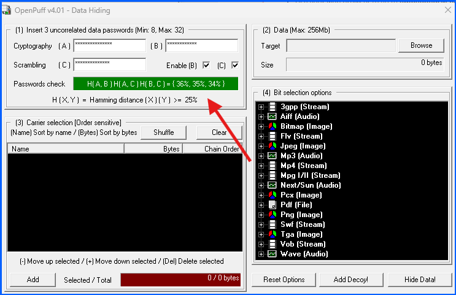
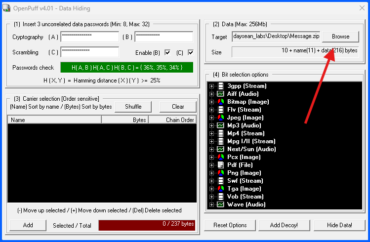
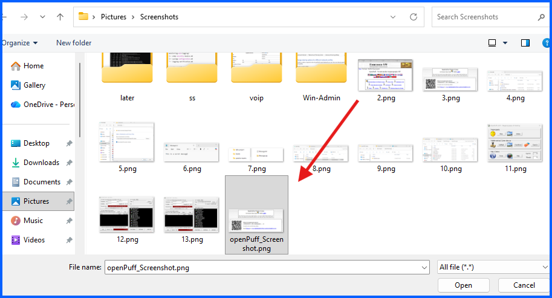
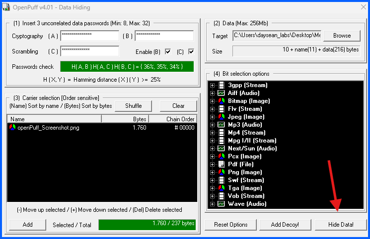
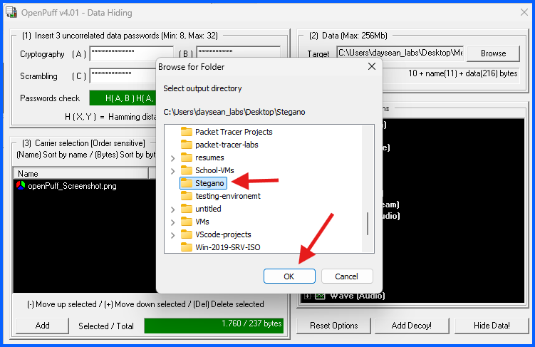
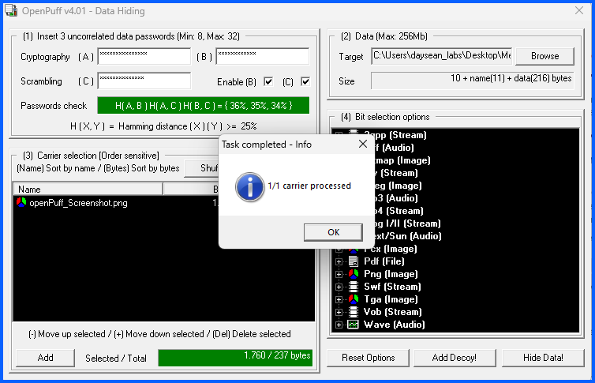
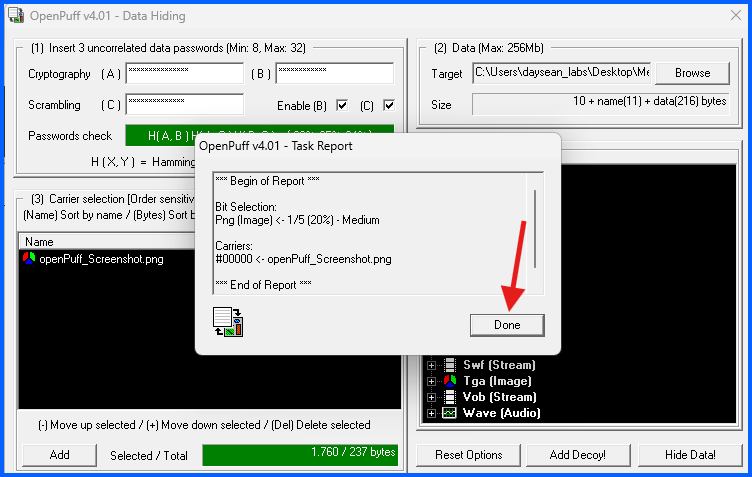
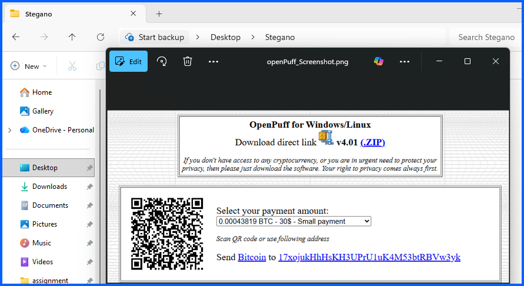

# Part B: Hide and Unhide Message

## Overview
In this section, I will use **OpenPuff** to embed a secret message inside a carrier image.

---

## Part B: Hide the Message

### Step 1: Open OpenPuff and Click Hide

1. Navigate to your **Downloads > OpenPuff_release > OpenPuff_release** folder

3. Run **OpenPuff.exe**

5. Click **Hide**

---

### Step 2: Set Up Passwords

Under section **(1)**, create three unrelated passwords and enter them:

- **Cryptography (A)** — first password
- **Cryptography (B)** — second password
- **Scrambling (C)** — third password (make it long enough so the Password check bar turns **green**)

**Note:** All three passwords are required to unhide the message later. Do not forget them (write them somewhere).

---

### Step 3: Load the Secret Message

Under section **(2)**:

1. Click **Browse**
2. Navigate to **Desktop** (this is where I saved the Messave.zip)
3. Select **Message.zip**
4. Click **Open**

---

### Step 4: Load the Carrier File

Under section **(3)**:
1. Click **Add**
2. Navigate to **Pictures > Screenshots** folder (this is where the screenshot is)

4. Select **openPuff_Screenshot.png**
5. Click **Open**

**Note:** The carrier file is the image that will contain the hidden message embedded inside it.

---

### Step 5: Hide the Data

1. Click **Hide Data!**

2. When prompted to select an output directory, navigate to the **Stegano** folder on your Desktop
3. Click **OK**

5. When the task completes, click **OK** on the confirmation dialog

7. Read the task report, then click **Done**

---

### Step 6: Verify the Carrier File

1. Navigate to your **Desktop > Stegano** folder
2. Open **openPuff_Screenshot.png**

**Can you detect anything different?** I cant detect anything different with the image it looks the same. (this is the point of steganography. The hidden message is invisible to the naked eye)

