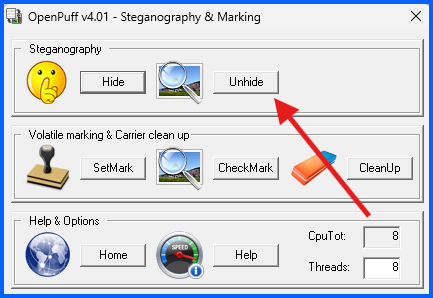
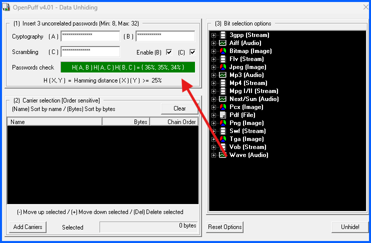
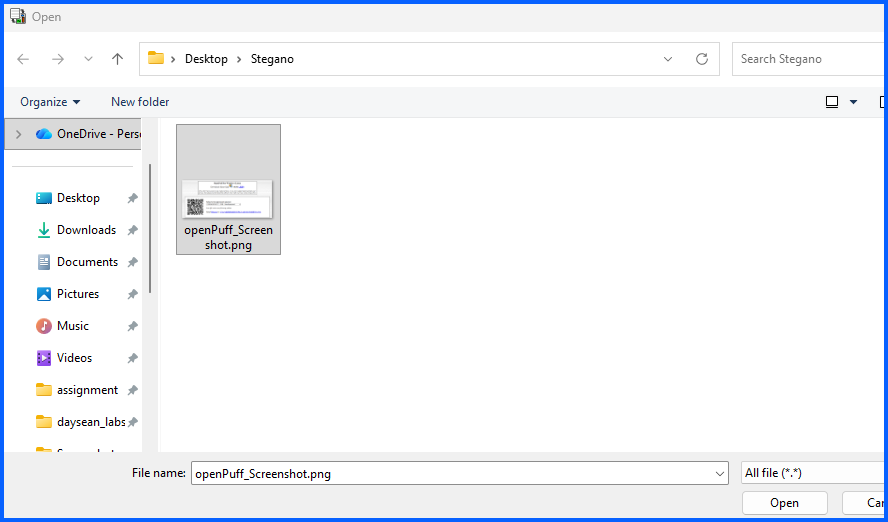
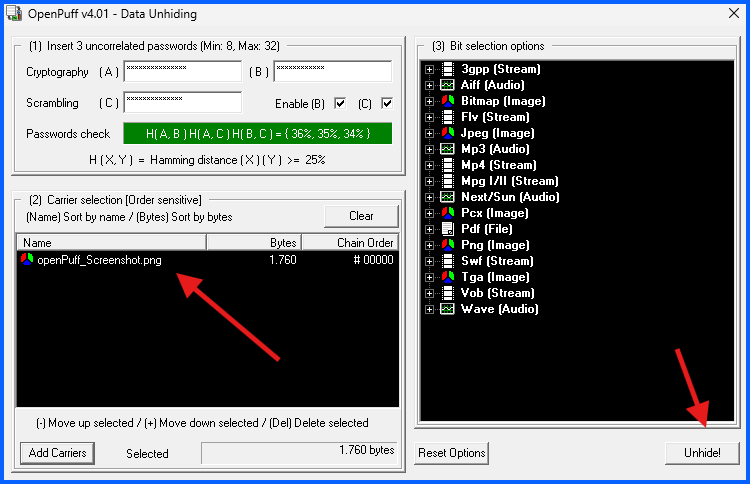
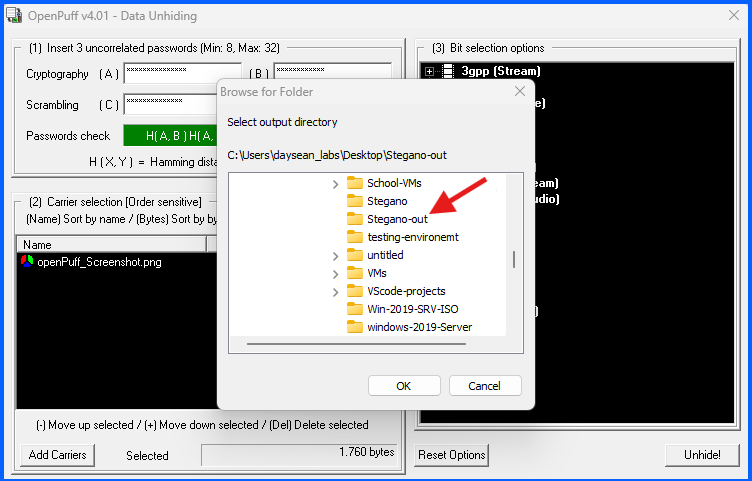

# Part C: Unhide Message using OpenPuff

## Overview
In this section, I will use **OpenPuff** to recover a hidden secret message inside a carrier image.

---

### Step 1: Return to the Main Menu

1. Close the Data Hiding window by clicking the **X** in the top right
2. You will be returned to the OpenPuff main menu

---

### Step 2: Click Unhide

1. From the main menu, click **Unhide**

---

### Step 3: Enter the Three Passwords

Under section **(1)**, re-enter the same three passwords you used when hiding the message:

- **Cryptography (A)**
- **Cryptography (B)**
- **Scrambling (C)**

---

### Step 4: Load the Carrier File

1. Click **Add Carriers**
2. Navigate to **Desktop > Stegano**
3. Select **openPuff_Screenshot.png**
4. Click **Open**

---

### Step 11: Unhide the Data

1. Click **Unhide!**
2. When prompted to select an output directory, navigate to the **Stegano-out** folder on your Desktop
3. Click **OK**

