# 01-SSL-Server-Security-Assessment

## Overview
This lab evaluates the security configuration of web servers and web browsers using the Qualys SSL Labs testing platform. The purpose is to understand how SSL/TLS configurations protect communications between clients and servers and to identify potential security weaknesses.

In this assessment, SSL Labs is used to analyze:
- SSL/TLS protocol support
- Digital certificate configuration
- Cipher suite strength
- Key exchange mechanisms

---

## Objectives
- Analyze the SSL/TLS security configuration of web servers
- Understand how SSL Labs evaluates server security
- Identify weak protocols and insecure cipher suites
- Review certificate chains and trust relationships

---

### Step 1: Access SSL Labs

1. Open a web browser.
2. Navigate to the SSL Labs website: **https://www.ssllabs.com**

3. Click **"Test Your Server"**.

---

### Step 2: Analyze a Highly Rated Server
1. Under **Recent Best**, select the first website listed.

Review the **Summary** section and record the following:

- Overall Rating

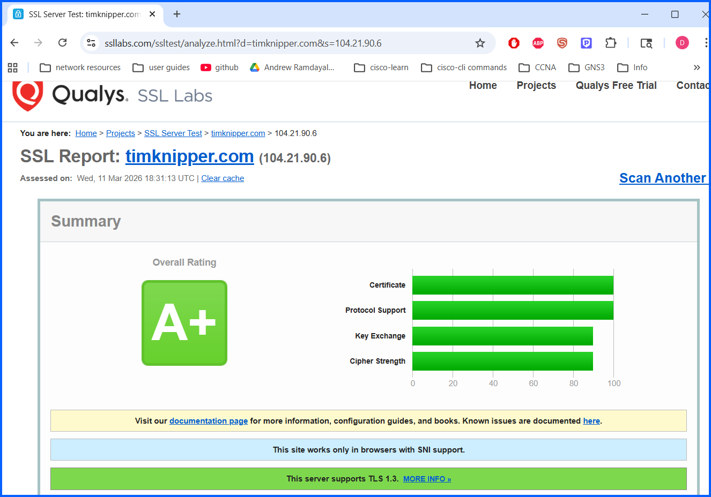

- Certificate 

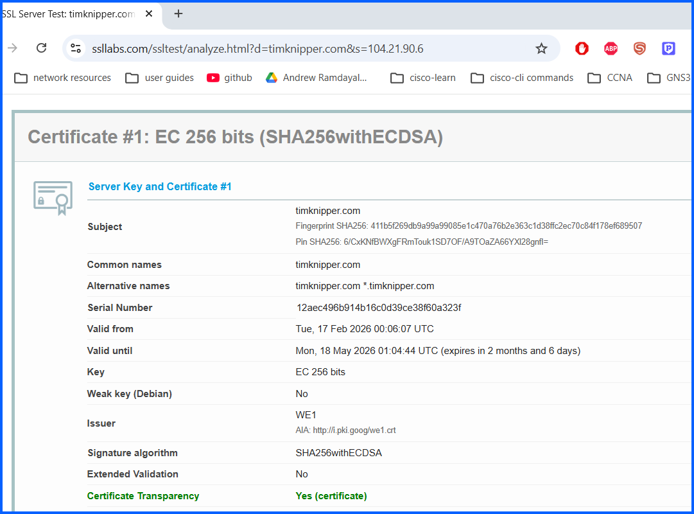

- Protocol support score

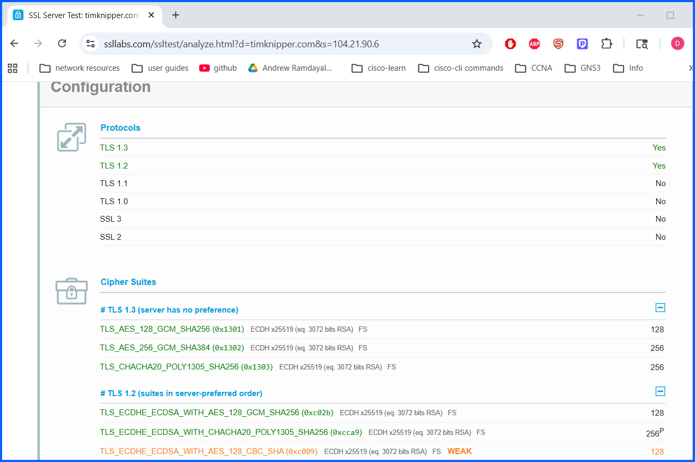

A strong server configuration typically receives an **A or A+ rating**, indicating secure protocol configuration and strong encryption.

---

### Step 3: Review Certificate Information
Scroll down to **Certificate #1**.

Observe:
- Certificate issuer
- Signature algorithm
- Key size
- Validity dates
- Site alternative names

Expand the **Certification Paths** section to view the certificate chain.

---

### Step 4: Analyze Supported Protocols

Navigate to the **Configuration** section.

Review the supported protocols such as: TLS 1.2, 1.3

For stronger security, servers should **disable outdated protocols** such as: SSL, TLS 1.0, TLS 1.1

---

### Step 5: Evaluate Cipher Suites
Locate the **Cipher Suites** section.

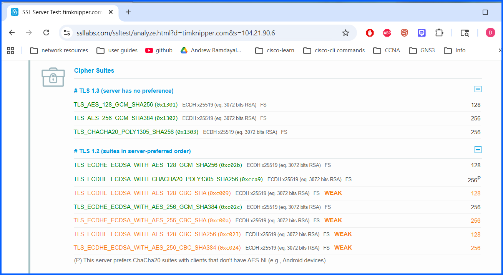

Cipher suites define how encryption is performed during a TLS handshake. They include:

- Key exchange algorithms
- Authentication methods
- Encryption algorithms
- Message authentication codes

Cipher suites are listed in **server-preferred order**.

The most secure configurations prioritize cipher suites that use:

- **ECDHE key exchange**
- **AES-GCM encryption**
- **Forward secrecy**

---

### Step 6: Review Handshake Simulation
Open the **Handshake Simulation** section.

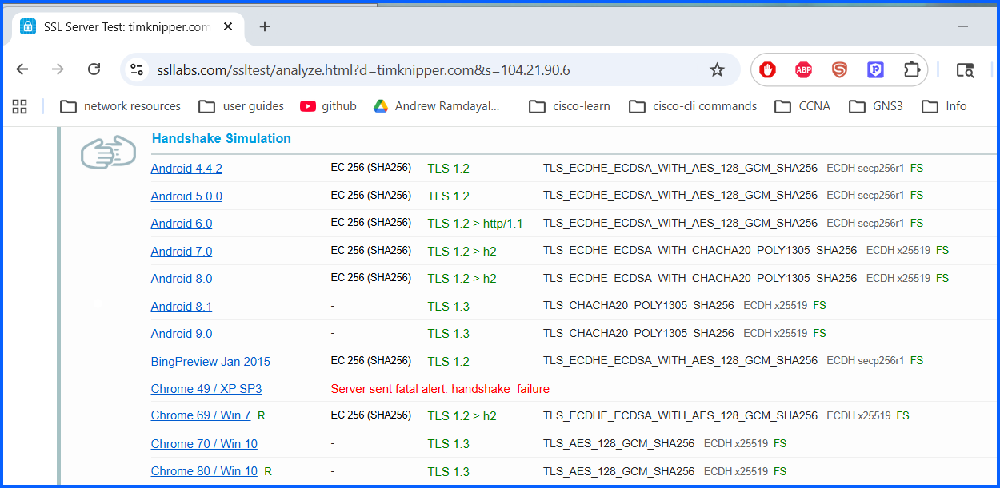

Select a browser and operating system similar to yours (Im using google chrome).

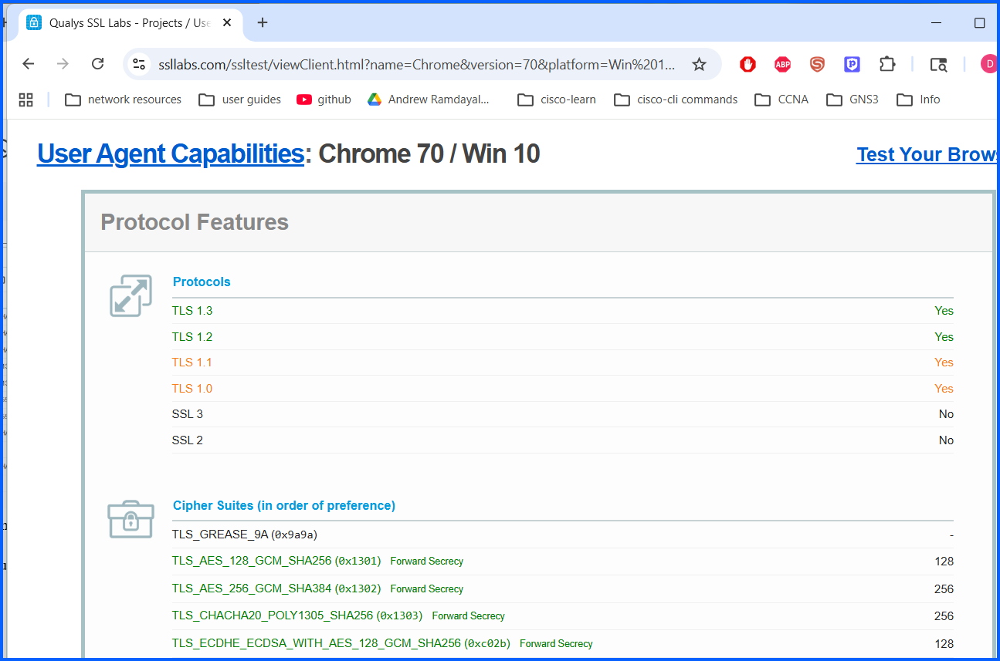

This section simulates how different clients connect to the server and shows: **Supported TLS version**s, **Cipher suite negotiation**, **Browser compatibility**

---

### Step 7: Analyze a Poorly Configured Server
Return to the SSL Labs homepage **https://www.ssllabs.com/ssltest/**.

Under **Recent Worst**, select a poorly rated site.

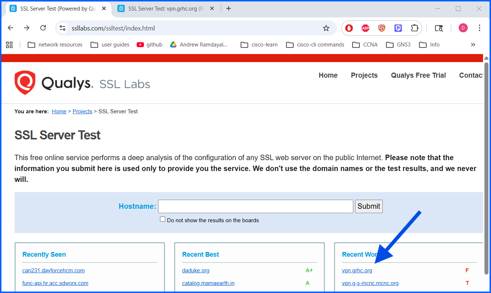

Review the **summary**:

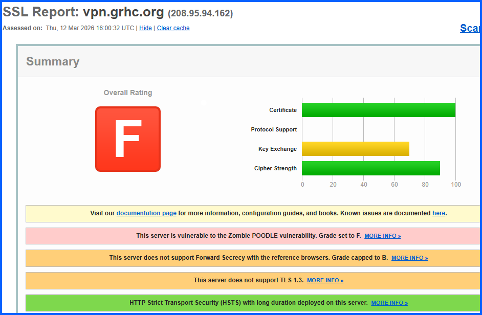

Review **Configuration**

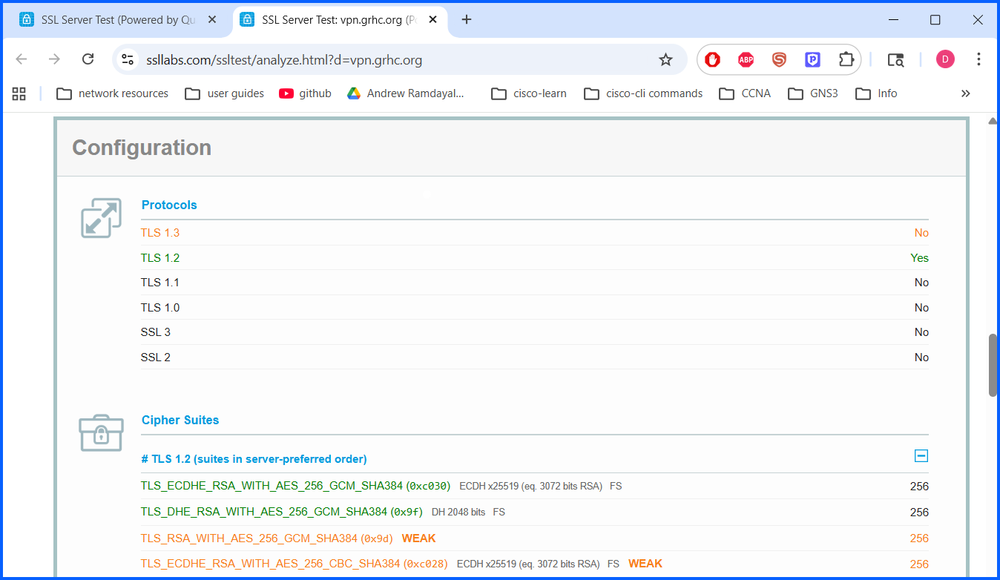

Review **Handshake simulation**

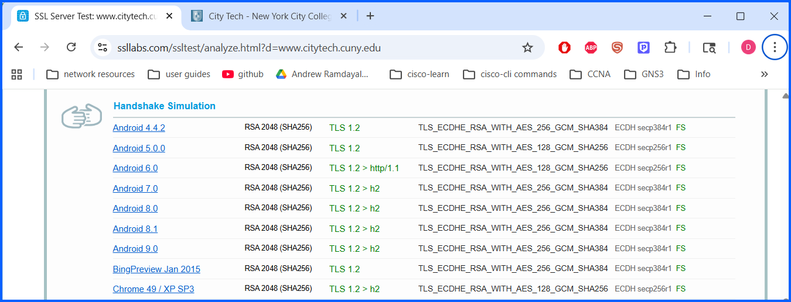

### Step 8: Test a Real Your Organization or School Website

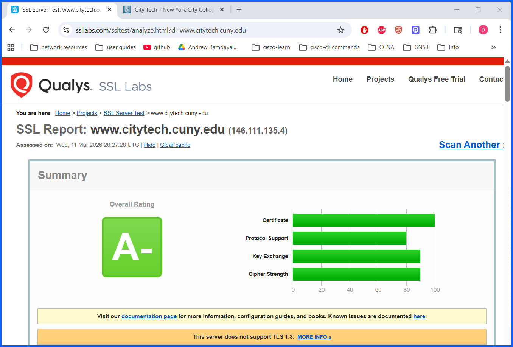

My school website received an **A- rating**, indicating generally strong security with minor improvements possible.

---

## Findings
The SSL Labs platform provides a detailed analysis of server-side SSL/TLS implementations. Servers with strong configurations prioritize modern protocols, strong cipher suites, and properly configured certificate chains.

Servers that support outdated protocols or weak encryption mechanisms are more vulnerable to cryptographic attacks.

---

## Conclusion
SSL/TLS configuration plays a critical role in protecting web communications. Using tools such as SSL Labs allows users to identify weaknesses and improve encryption practices.

Organizations should regularly audit their SSL/TLS configurations to ensure compliance with modern security standards and to protect sensitive user data transmitted over the internet.
