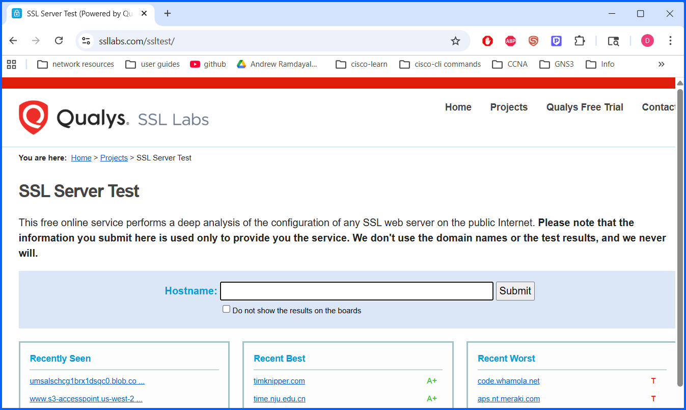
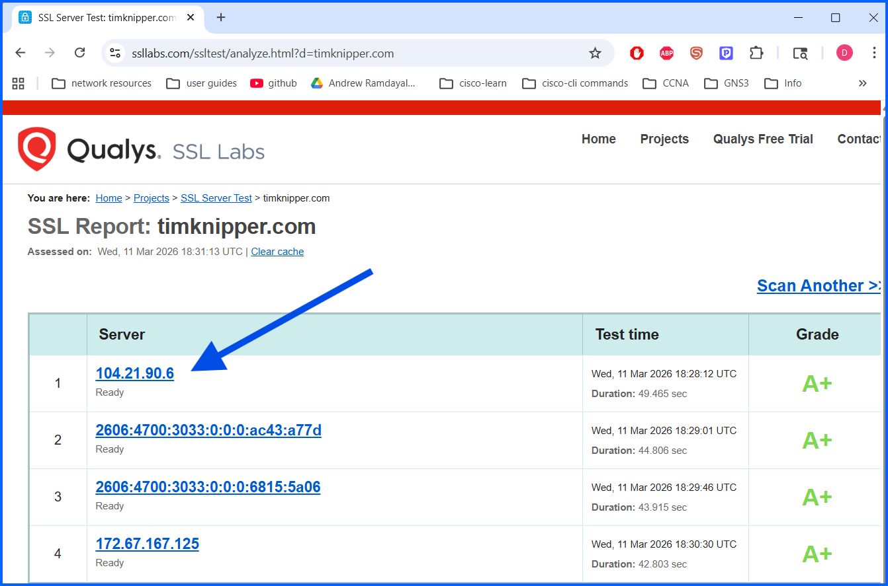

# 01-SSL-Server-Security-Assessment

## Overview
This lab evaluates the security configuration of web servers and web browsers using the Qualys SSL Labs testing platform. The purpose is to understand how SSL/TLS configurations protect communications between clients and servers and to identify potential security weaknesses.

In this assessment, SSL Labs is used to analyze:
- SSL/TLS protocol support
- Digital certificate configuration
- Cipher suite strength
- Key exchange mechanisms

---

## Objectives
- Analyze the SSL/TLS security configuration of web servers
- Understand how SSL Labs evaluates server security
- Identify weak protocols and insecure cipher suites
- Review certificate chains and trust relationships

---

### Step 1: Access SSL Labs

1. Open a web browser.
2. Navigate to the SSL Labs website: **https://www.ssllabs.com**

3. Click **"Test Your Server"**.

---

### Step 2: Analyze a Highly Rated Server
1. Under **Recent Best**, select the first website listed.

