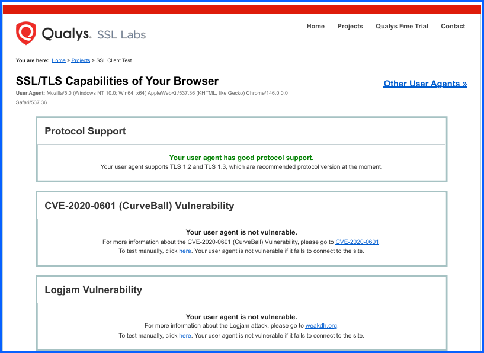
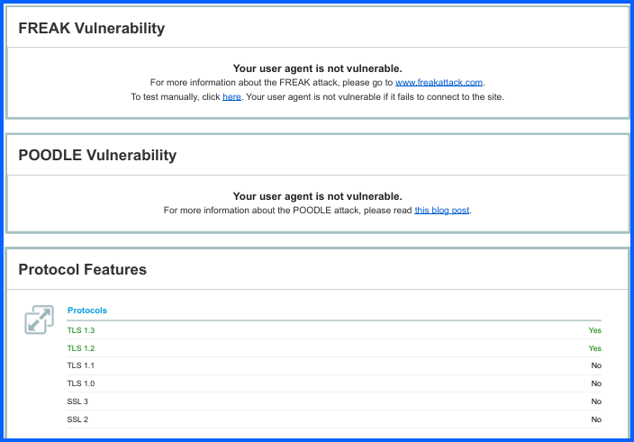

# 02 SSL Client Test Google Chrome

## Overview
This lab evaluates the SSL/TLS security capabilities of the **Google Chrome web browser** using the **Qualys SSL Labs Client Test** tool.

The test analyzes how the browser handles encrypted communications, including supported protocols, cipher suites, and vulnerability protections. Understanding browser SSL/TLS capabilities is important because web browsers act as the client in secure communications and must properly support modern encryption standards.

The results provide insight into how Chrome protects users against common cryptographic vulnerabilities.

---

## Objective
- Evaluate the SSL/TLS capabilities of Google Chrome
- Identify supported encryption protocols
- Review supported cipher suites
- Verify protection against known cryptographic vulnerabilities

---

### Step 1: Access SSL Labs

1. Open a web browser.
2. Navigate to the SSL Labs website: **https://www.ssllabs.com**

3. Click on **projects**

5. Click on **SSL Client Test**

## 1. Protocol Support

Chrome supports the latest secure TLS protocols and disables legacy protocols.

| Protocol | Supported |
|---|---|
| TLS 1.3 | Yes |
| TLS 1.2 | Yes |

---

## 2. Vulnerability Protection

The scan confirms Chrome is protected against several major TLS-related attacks.

| Vulnerability | Status |
|---|---|
| CVE-2020-0601 (CurveBall) | Not Vulnerable |
| Logjam Attack | Not Vulnerable |
| FREAK Attack | Not Vulnerable |
| POODLE Attack | Not Vulnerable |

---

## 3. Cipher Suites

Chrome prioritizes **modern cipher suites that provide forward secrecy and strong encryption**.

### Strong Cipher Suites

| Cipher Suite | Encryption | Security Feature |
|---|---|---|
| TLS_AES_128_GCM_SHA256 | 128-bit | Forward Secrecy |
| TLS_AES_256_GCM_SHA384 | 256-bit | Forward Secrecy |
| TLS_CHACHA20_POLY1305_SHA256 | 256-bit | Forward Secrecy |
| TLS_ECDHE_ECDSA_WITH_AES_128_GCM_SHA256 | 128-bit | Forward Secrecy |
| TLS_ECDHE_RSA_WITH_AES_128_GCM_SHA256 | 128-bit | Forward Secrecy |

