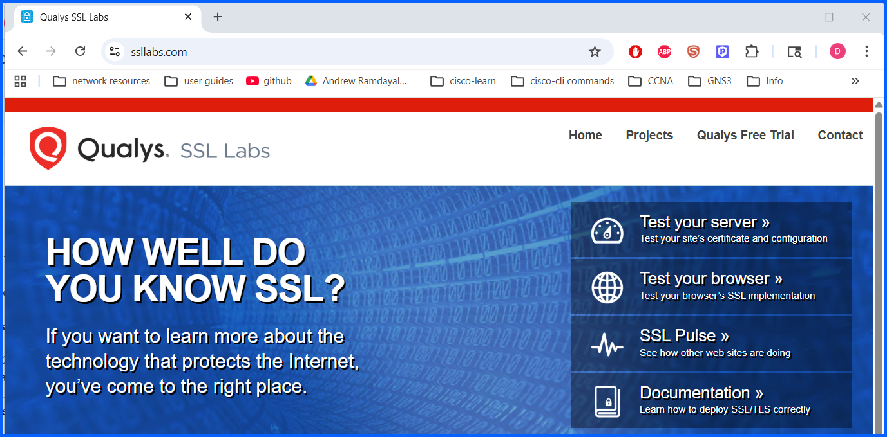

# 02 SSL Client Test Google Chrome

## Overview
This lab evaluates the SSL/TLS security capabilities of the **Google Chrome web browser** using the **Qualys SSL Labs Client Test** tool.

The test analyzes how the browser handles encrypted communications, including supported protocols, cipher suites, and vulnerability protections. Understanding browser SSL/TLS capabilities is important because web browsers act as the client in secure communications and must properly support modern encryption standards.

The results provide insight into how Chrome protects users against common cryptographic vulnerabilities.

---

## Objective
- Evaluate the SSL/TLS capabilities of Google Chrome
- Identify supported encryption protocols
- Review supported cipher suites
- Verify protection against known cryptographic vulnerabilities

---

### Step 1: Access SSL Labs

1. Open a web browser.
2. Navigate to the SSL Labs website: **https://www.ssllabs.com**

