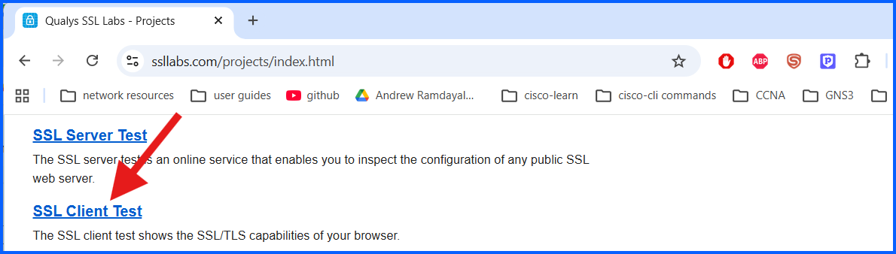
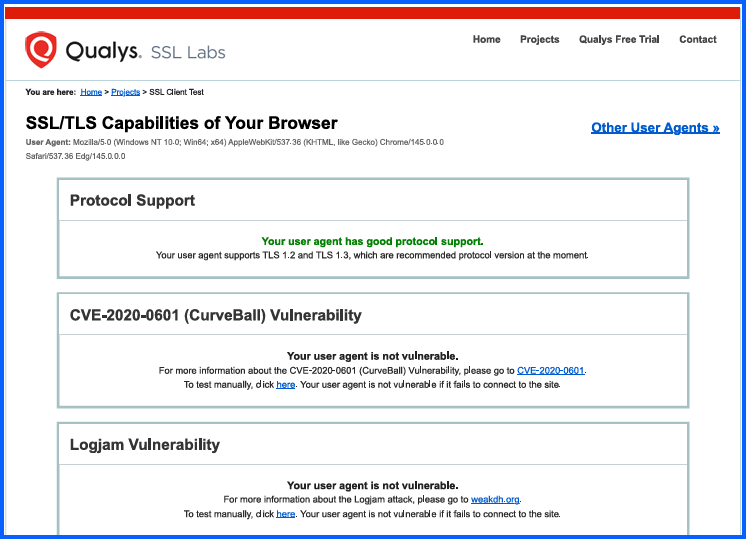
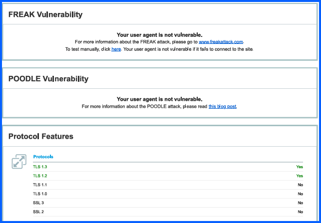

# 04 SSL Client Test Microsoft Edge

## Overview
This lab evaluates the SSL/TLS security capabilities of **Microsoft Edge** using the **Qualys SSL Labs Client Test** tool. The test analyzes how the browser handles encrypted communications, including supported protocols, cipher suites, and protection against known cryptographic vulnerabilities.

Web browsers act as the client in HTTPS communications, so strong TLS support is essential for protecting data transmitted between users and web servers.

---

## Objective

- Evaluate Microsoft Edge SSL/TLS capabilities
- Identify supported encryption protocols
- Review supported cipher suites
- Verify protection against known TLS vulnerabilities
- Compare browser security with other browsers such as Google Chrome

---

### Step 1: Access SSL Labs

1. Open a web browser.
2. Navigate to the SSL Labs website: **https://www.ssllabs.com**

3. Click on **projects**

5. Click on **SSL Client Test**

# SSL Client Test Results

## 1. Protocol Support

The SSL Labs report shows that Microsoft Edge supports modern TLS protocols while disabling legacy protocols.

| Protocol | Supported |
|---|---|
| TLS 1.3 | Yes |
| TLS 1.2 | Yes |

Supports only TLS 1.2 and TLS 1.3 helps protect against known vulnerabilities in older encryption protocols. 

## 2. Vulnerability Protection

The scan verifies that Microsoft Edge is protected against several major cryptographic attacks.

| Vulnerability | Status |
|---|---|
| CVE-2020-0601 (CurveBall) | Not Vulnerable |
| Logjam Attack | Not Vulnerable |
| FREAK Attack | Not Vulnerable |
| POODLE Attack | Not Vulnerable |

---

## 3. Cipher Suites

Microsoft Edge prioritizes strong cipher suites that support **forward secrecy and authenticated encryption**.

### Strong Cipher Suites

