# 01 – Passwords and Autofill Security (Google Chrome)

## Overview

In this section of the lab, I reviewed and configured **Google Chrome's Password and Autofill security settings** to improve account protection and reduce the risk of credential being compromise.

These settings help users detect **weak or compromised passwords**, control stored credentials, and manage sensitive autofill data such as payment methods and addresses.

---

# Password Manager Security Review

## Step 1: Accessing Chrome Password and Autofill Settings

1. Open **Google Chrome**

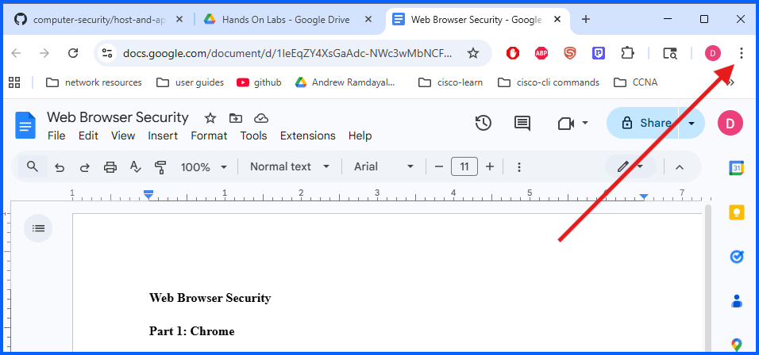

2. Click the **three-dot menu** in the top-right corner
3. Click **Settings**

Or go to: chrome://settings/

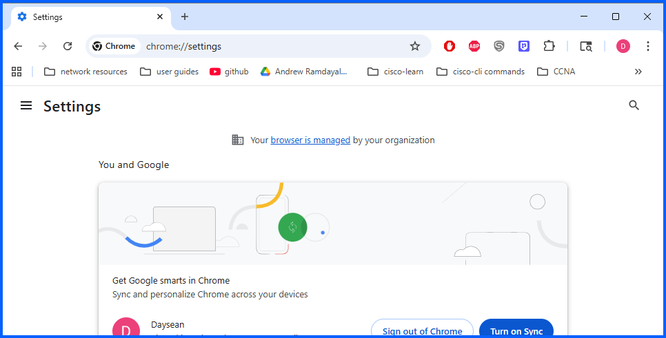

From the settings menu:

1. Clicked the **menu icon (three horizontal lines)** in the top-left corner

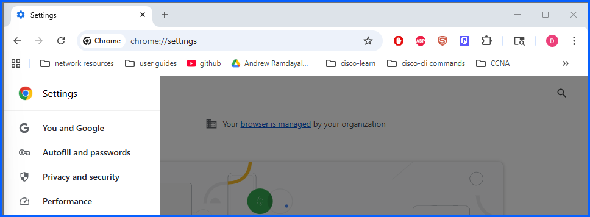
Note: Ive split my screen into 2 thats why I have the 3 horizontal lines but if your in full screen you will see the menu on the left side

2. Select **Passwords and Autofill**

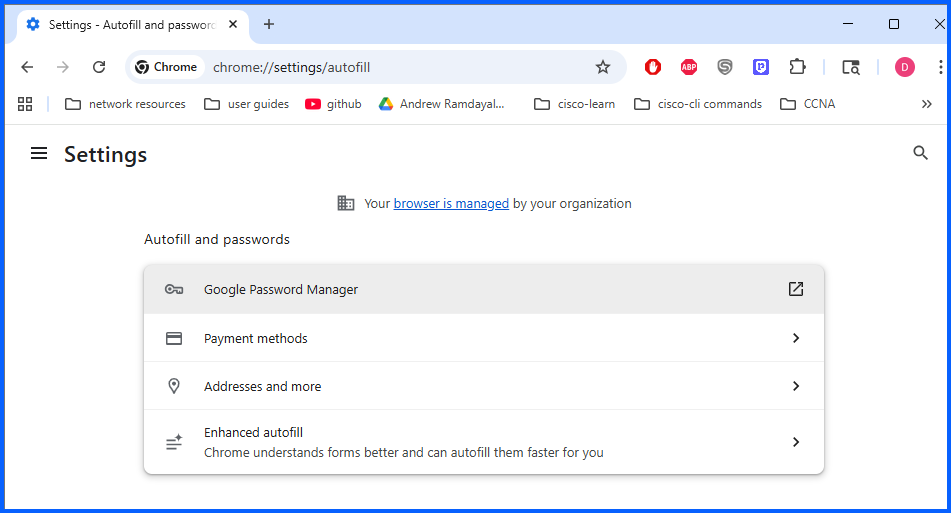

---

## Step 2: Check for compromised passwords

1. Click on **Google Password Manager**

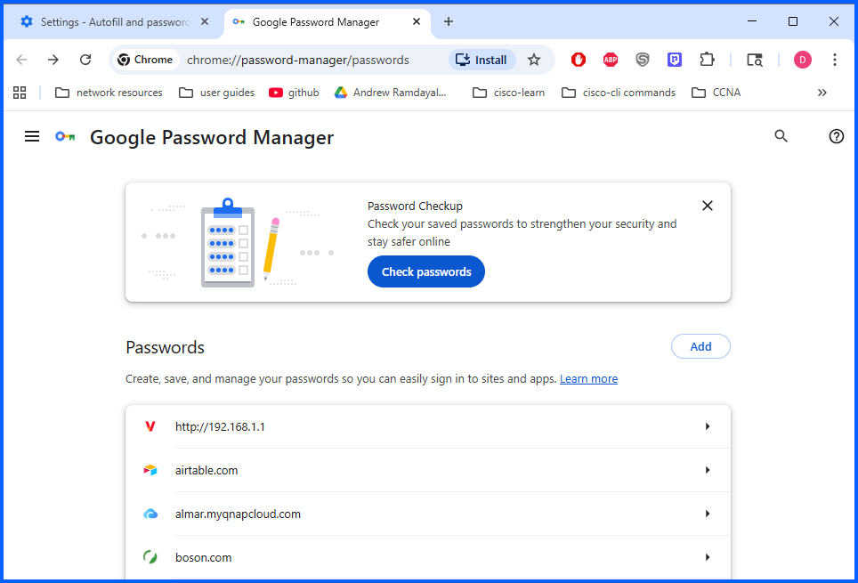

2. Click **Check passwords**

Note: if you dont have any saved password nonthing will show

Chrome scans stored credentials and identifies:

- **Compromised passwords**
- **Weak passwords**

**Results:**

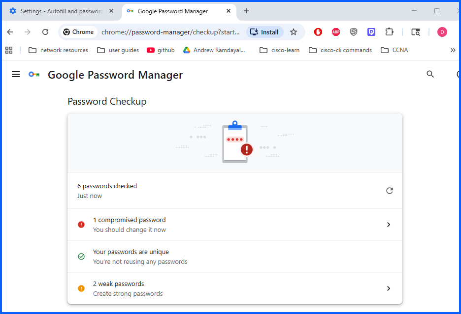

## Step 3: ## Compromised Password Detection

During the password security check, Chrome identified a **compromised password**.

For demonstration purposes, I intentionally created this weak password for demonstration to trigger this alert.

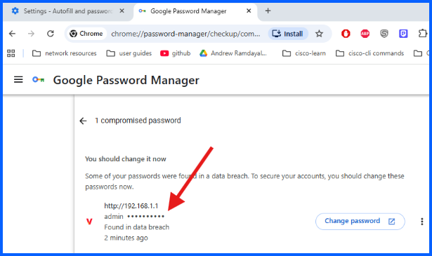
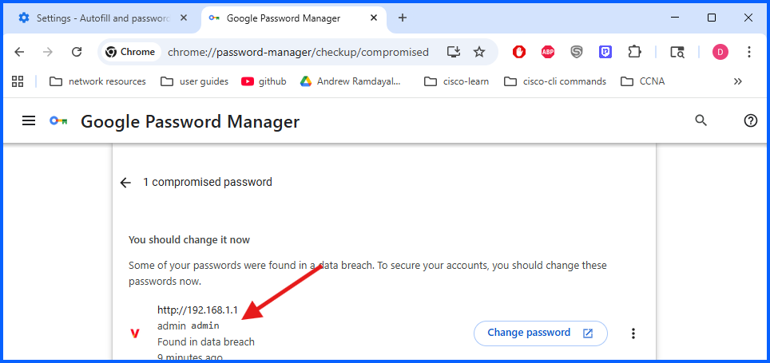

### Fix
1. Click the compromised password entry
2. Click **Change password**
3. Chrome redirects to the associated website
4. Update the password with a **strong and unique password**
5. Then upddate the new passsword in password manager

## Step 3: ## Compromised Password Identification

Chrome also flagged **weak passwords** stored in the browser.

Weak passwords increase the risk of:

- Account compromise
- Brute-force attacks

### Fix

1. Clicked on **2 weak passwords**

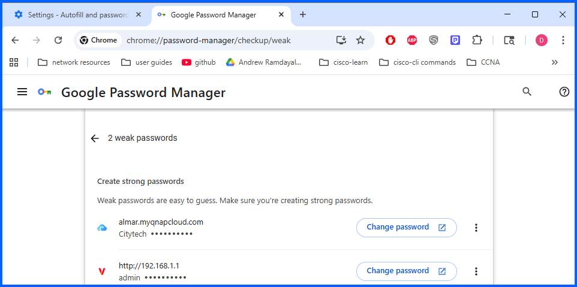

2. Click **Change password**
3. Chrome redirects to the associated website
4. Update the password with a **strong and unique password**
5. Then upddate the new passsword in password manager

Recommended password best practices include:

- Minimum **12–16 characters**
- Use of **uppercase letters**
- **Lowercase letters**
- **Numbers**
- **Special characters**

Do not include something like your, name, birthday, pet name etc.

# Password Manager Settings Review

1. Clicked the 3 horizontal lines on the top left and click settings

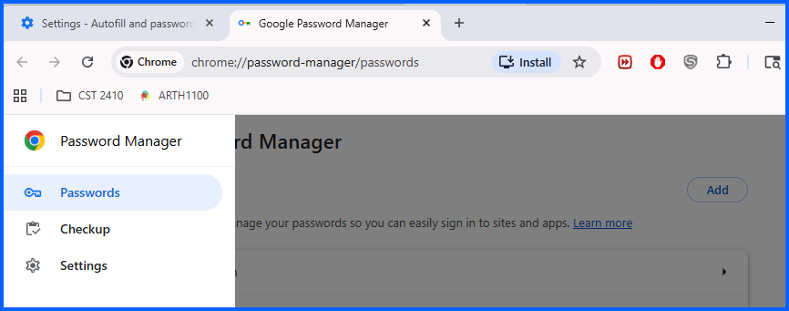
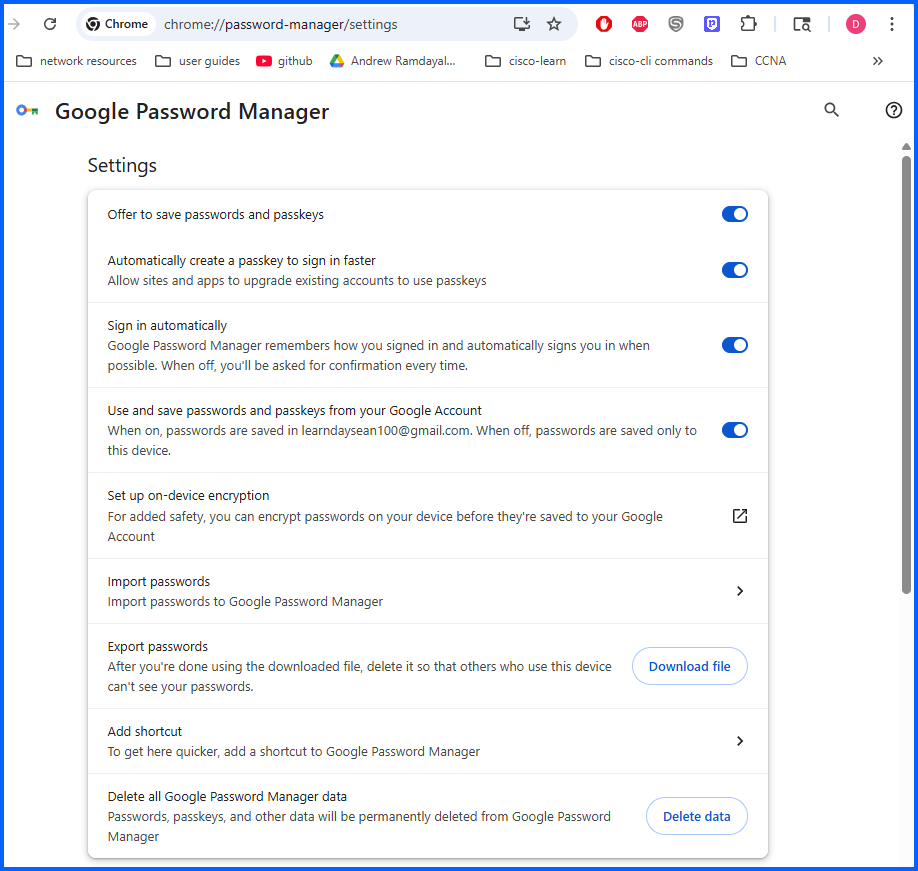

The first four options are **enabled by default**, which improves overall password security.

These features allow Chrome to:

- Save passwords securely
- Autofill credentials on websites
- Detect compromised passwords

Additional available features include:

- **Import passwords**
- **Export passwords**
- **On-device encryption for password protection**

On-device encryption adds an additional security layer.

---

# Password Data Management

Chrome also provides the option to delete stored credentials.

You can remove all stored credentials and passkeys by selecting: **Delete data**

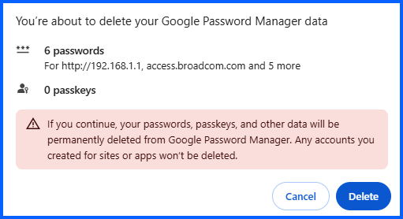

---

# Secure Payment Methods

Chrome allows users to save payment methods for faster checkout.

To review payment settings: go to **chrome://settings/autofill**

Then select: **Payment methods**

Note: I don't have any payment methods saved. If payment methods are stored, enabling the following security option is recommended:

**Verify it’s you to autofill payment methods**

This ensures that Chrome confirms the user's identity before automatically filling payment information.

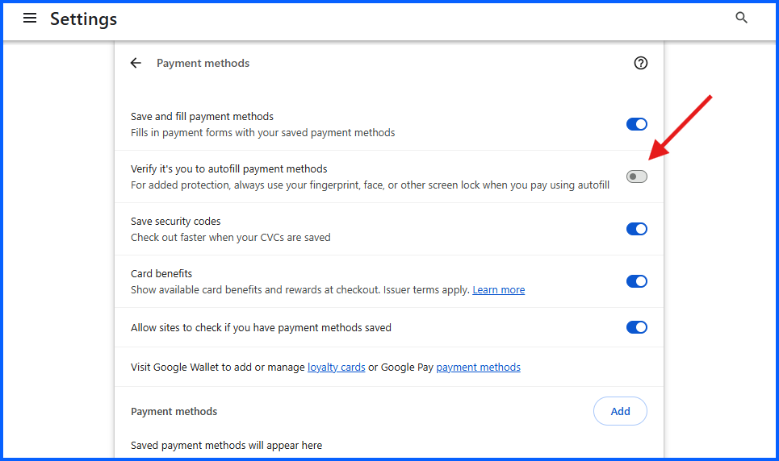

If you share a computer with other people I wouldn't recommend you save password, payments and addresses on that shared computer. You should save passwords on an online password manager.

