# 02 – Privacy and Security Settings (Google Chrome)

## Overview

In this section of the lab, I reviewed and configured **Google Chrome’s Privacy and Security settings** to strengthen browser protection against malicious websites, tracking technologies, and insecure connections.

---

# Accessing Privacy and Security Settings

1. Open **Google Chrome**

2. Click the **three-dot menu** in the top-right corner
3. Click **Settings**

Or go to: **chrome://settings/**

From the settings menu:

1. Clicked the **menu icon (three horizontal lines)** in the top-left corner

Note: Ive split my screen into 2 thats why I have the 3 horizontal lines but if your in full screen you will see the menu on the left side

2. Select **Privacy and Security**

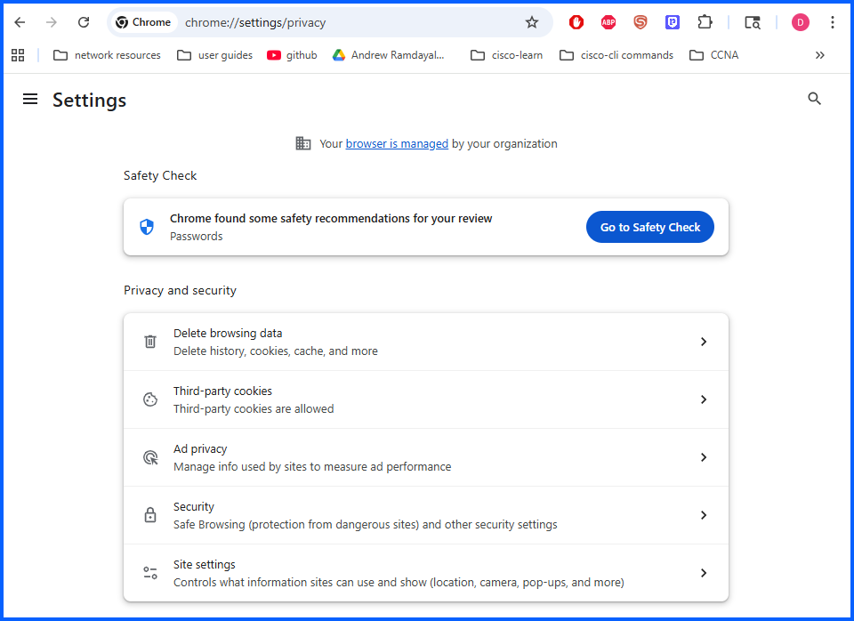

---

## Step 1: Clearing Browsing Data

1. Click **Delete browsing data**

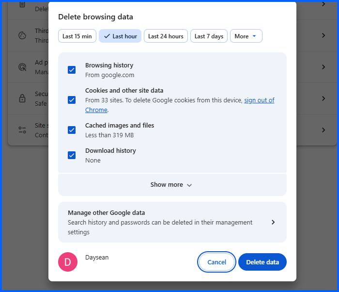

2. Select **More**
3. Change the time range to **All time**

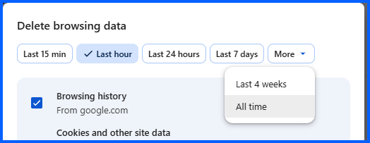

4. Click **Show more**
5. Select all available options
6. Click **Delete data**

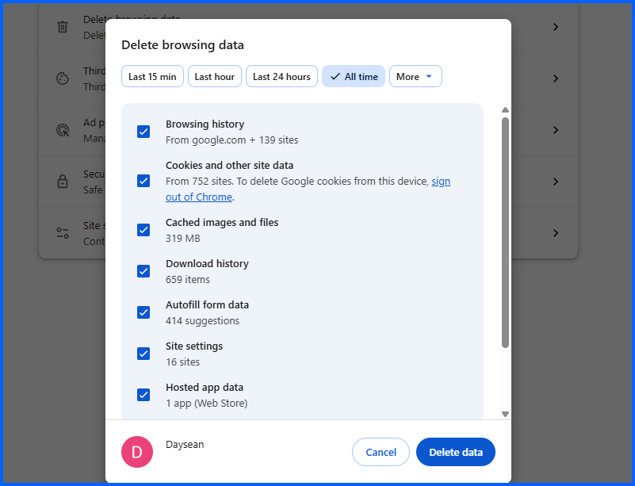

If you share your computer with someone I recommend you do this after you're done using your computer.

---

## Step 2: Third-Party Cookie Protection

Third-party cookies are commonly used for:

- User tracking
- Advertising
- Behavioral analytics

Back in **chrome://settings/privacy**

1. Click on **Third-party cookies**

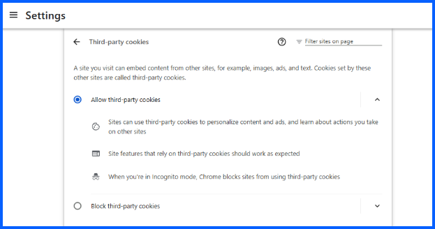

3. Select **Block third-party cookies**

Note: most website uses thrif-party cookies, If necessary, specific websites can be added to an **allowed list**. See bellow

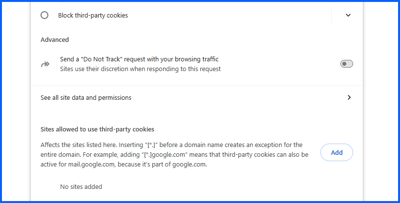

## Step 3: Site Data and Permissions

Chrome allows users to view and manage stored site data and permissions.

To review site data:

1. Click on **See all site data and permissions**

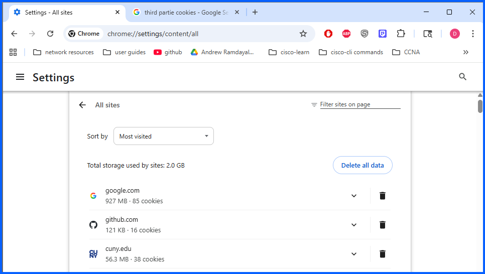

2. Click the delete logo on the right 

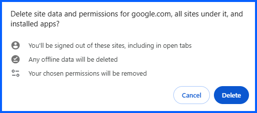

## Step 4: Ad Privacy Settings

Chrome includes advertising privacy controls that manage how ads are measured and displayed.

To access these settings: 

1. Go to **chrome://settings/privacy**
2. Click **Ad privacy**
3. Click **Ad measurement**

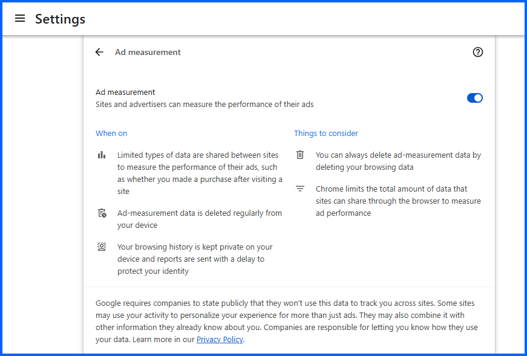

Disabling ad measurement reduces data sharing used for advertising analytics.

## Step 5: Enhanced Safe Browsing Protection

Back in **chrome://settings/privacy**

Chrome provides **Safe Browsing protection** to detect dangerous websites and downloads.

1. Click on Security

Check Enhanced protection. This uses AI-powered protection against dangerous sites

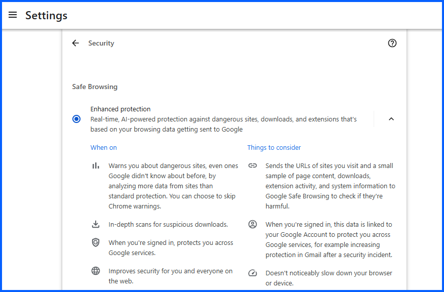

## Step 6: Secure Connection Enforcement

1. Scroll down under **chrome://settings/security**

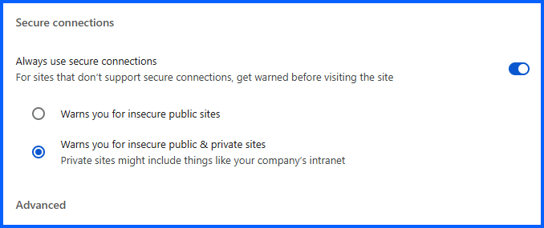

2. Enable **Always use secure connections**
3. Check **Warns you for insecure public & private sites**

This setting ensures Chrome warns users before visiting websites that do not use encrypted connections.

  
