# 01 – Passwords and Autofill Security (Microsoft Edge)

## Overview

In this section of the lab, I reviewed and configured **Microsoft Edge's Password and Autofill security settings** to improve account protection and reduce the risk of credential being compromise.

These settings help users detect **weak or compromised passwords**, control stored credentials, and manage sensitive autofill data such as payment methods and addresses.

---

# Password Manager Security Review

## Step 1: Accessing Microsoft Edge Password and Autofill Settings

1. Open **Microsoft Edge**

2. Click the **three-dot menu** in the top-right corner
3. Click **Settings**

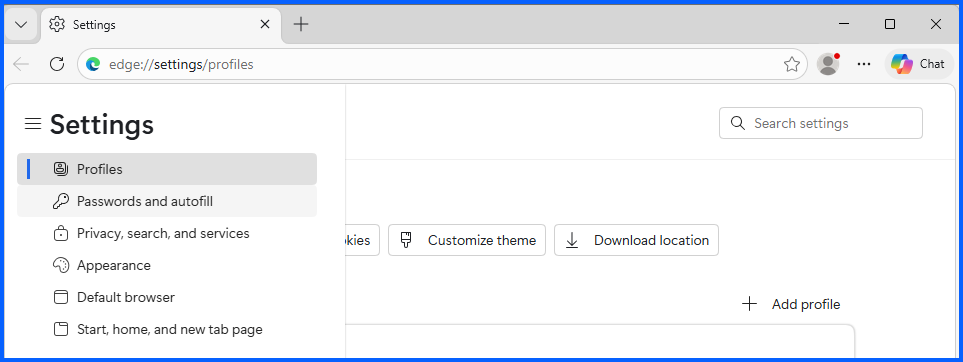

4. Select **Passwords and Autofill**

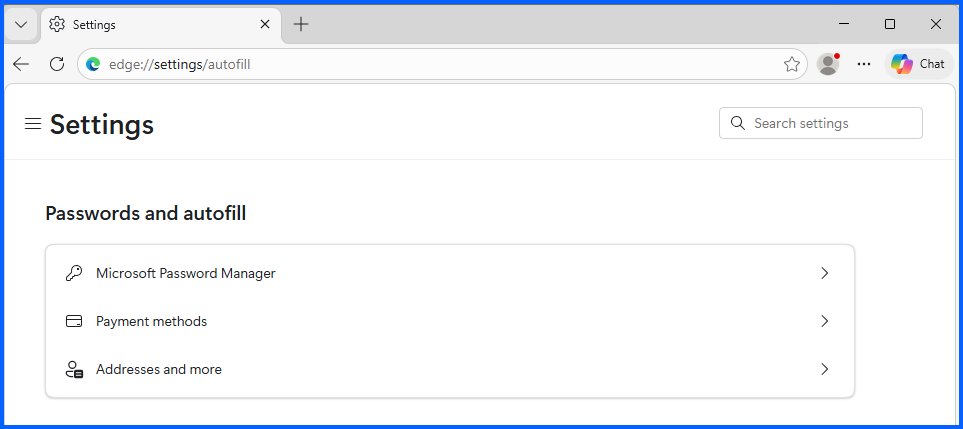

---

## Step 2: Check for compromised passwords

1. Click on **Microsoft Password Manager**

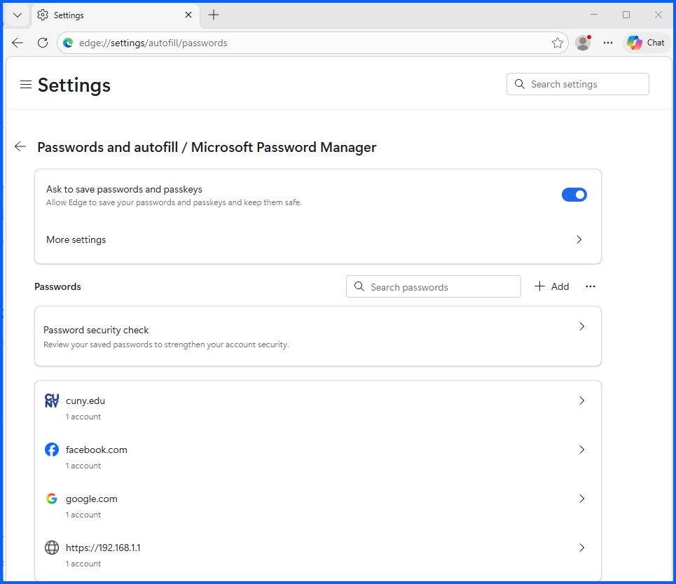

2. Click on **Password security check**
3. If it shows up: Enable **Check passwords for # sites and apps**

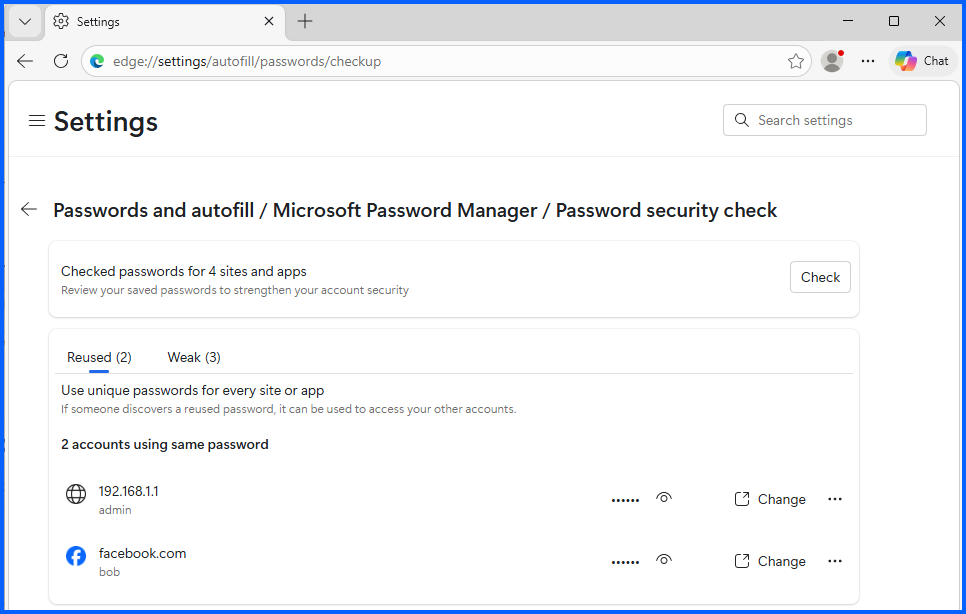

4. Click **check**

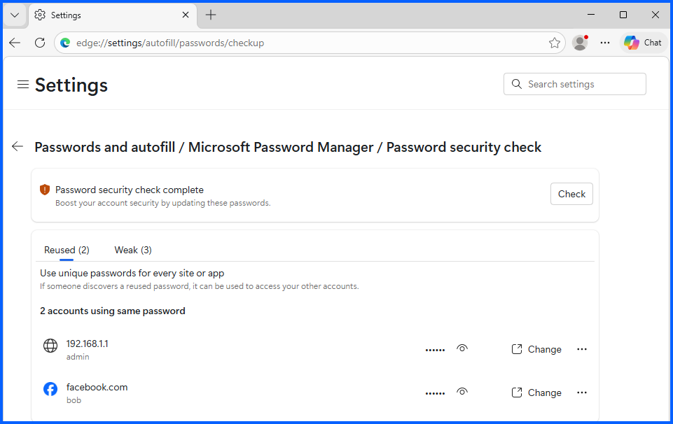

Note: if you dont have any saved password nonthing will show

Microsoft Edge scans stored credentials and identifies:

- **Weak passwords**
- **Reused passwords**

**Results:**

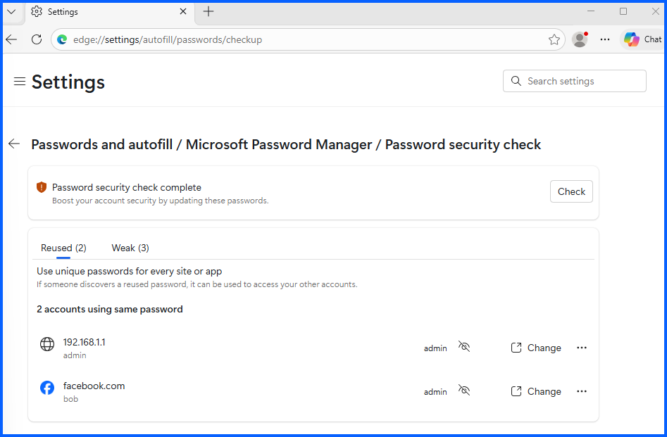
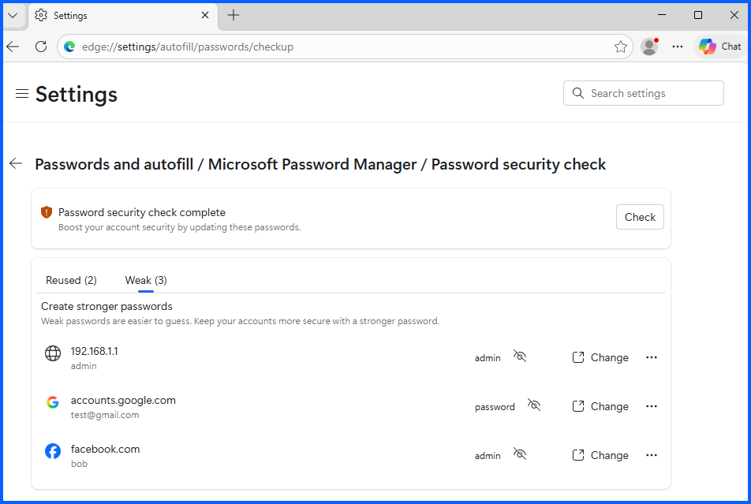

For demonstration purposes, I intentionally created thesse weak passwords for demonstration to trigger this alert.

### Fix
1. Click the Resused or Weak password entry
2. Click **Change**
3. Chrome redirects to the associated website
4. Update the password with a **strong and unique password**
5. Then update the new passsword in password manager

# Password Manager More settings Review

1. Go back (click the back logo top left) or **edge://settings/autofill**

2. Click **More settings**

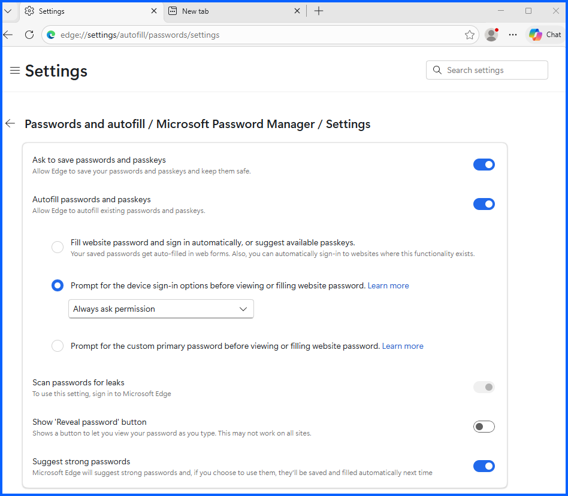

3. First you can choose to enable **Ask to save passwords and passkeys**. If you enable it, it will save you time from manually typing your usernames and password everytime you login.  
4. Enable **Autofill save passwords and passkeys**.
5. Enable **Prompt for the device sign-in options before viewing or filling website password**. Enter your username and password when prompted. And choose **Always ask permission**, this will ask you for username and password before its autofill. 

---

# Password Data Management

Microsoft Edge also provides the option to delete stored credentials.

1. In microsoft password manager or go to **edge://settings/autofill/passwords**

2. Click on an entry (Facebook for example)
3. Then Click Delete

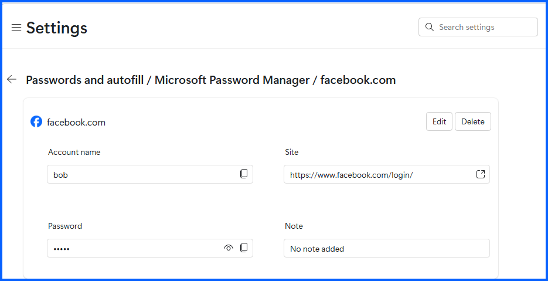

Additional available features include:
- **Import passwords**
- **Export passwords**

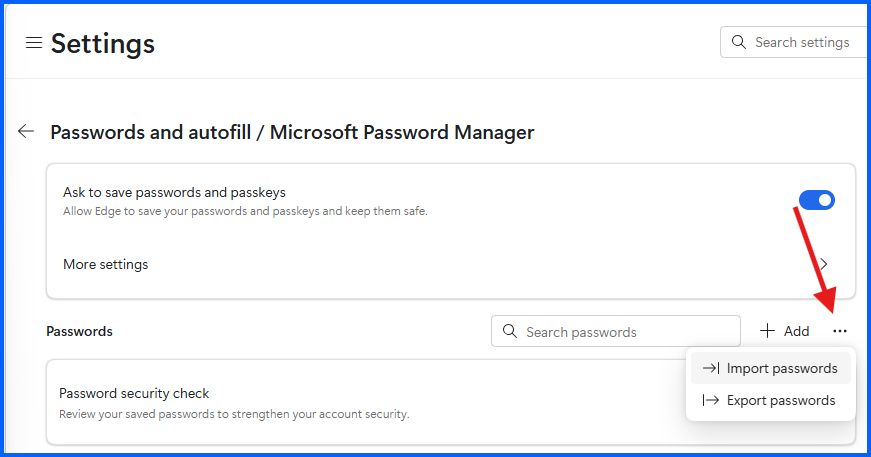

---

# Secure Payment Methods

Microsoft Edge allows users to save payment methods for faster checkout.

1. Go back (click the back logo top left) or **edge://settings/autofill**
2. Click **Payments methods**

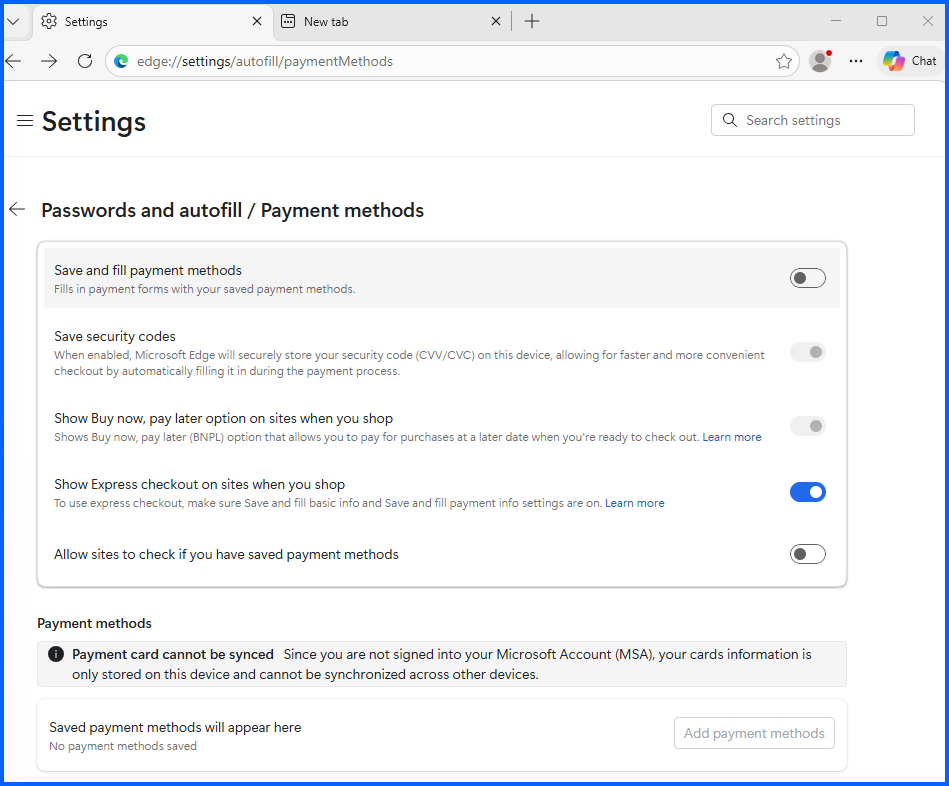

3. Disable **Save and fill payment methods**. I don't recommend you save payment methods.
4. Disable **Allow sites to check if you have saved payment methods**.

---

# Address Autofill Settings

Microsoft Edge can also store address information for form autofill.

1. Go back (click the back logo top left) or **edge://settings/autofill**
2. Click **Addresses and more**

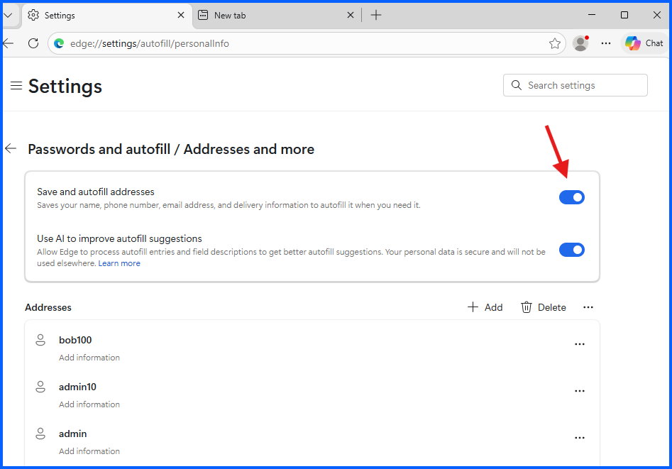

Note: I don't have any addresses saved. I recommend turned these options off. I wouldn't recommend you save addresses on your computer.

---

# Security Recommendations

- Regularly run **password security checks**
- Immediately update **compromised or weak passwords**
- Avoid storing passwords and payments on **shared computers**
- Disable **payment autofill**
- Disable unnecessary **autofill data storage**
- Consider using a **dedicated password manager**

Implementing these controls improves browser security and helps protect user credentials from compromise.

---

# Conclusion

The **Passwords and Autofill security review** focused on identifying weak or compromised credentials and limiting the storage of sensitive personal data in the browser.

These controls form an important part of **browser security hardening and user data protection**.
