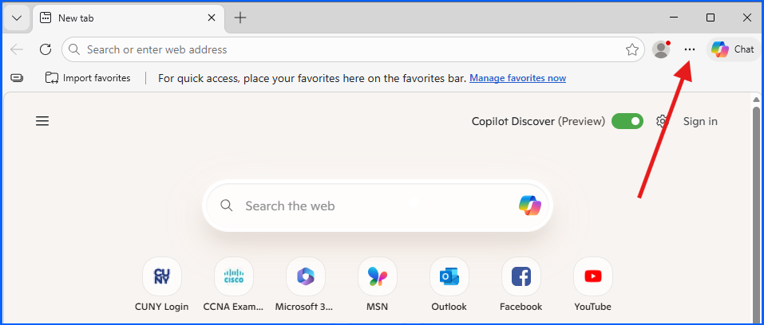
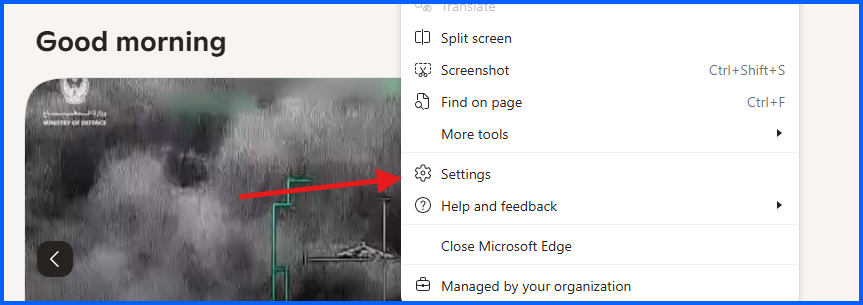

# 01 – Passwords and Autofill Security (Microsoft Edge)

## Overview

In this section of the lab, I reviewed and configured **Microsoft Edge's Password and Autofill security settings** to improve account protection and reduce the risk of credential being compromise.

These settings help users detect **weak or compromised passwords**, control stored credentials, and manage sensitive autofill data such as payment methods and addresses.

---

# Password Manager Security Review

## Step 1: Accessing Microsoft Edge Password and Autofill Settings

1. Open **Microsoft Edge**

2. Click the **three-dot menu** in the top-right corner
3. Click **Settings**

