# 02 – Privacy and Security Settings (Microsoft Edge)

## Overview

In this section of the lab, I reviewed and configured **Microsoft Edge’s Privacy and Security settings** to strengthen browser protection against malicious websites, tracking technologies, and insecure connections.

---

## Accessing Microsoft Edge Privacy, Search, and Services Settings

1. Open **Microsoft Edge**

2. Click the **three-dot menu** in the top-right corner
3. Click **Settings** Or go to: **edge://settings/profiles**

4. Click **Privacy, search, and services**

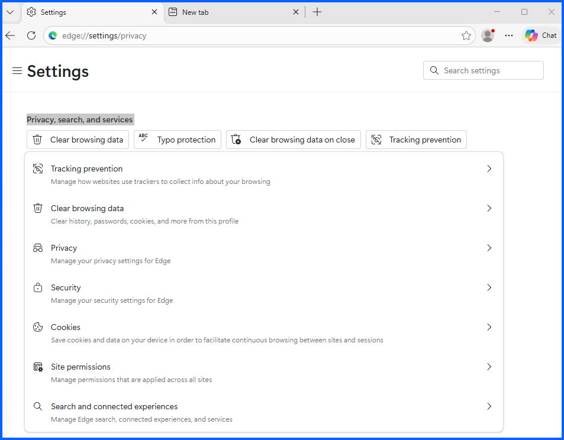

---

## Step 1: Clearing Browsing Data

1. Click **Clear browsing data**
2. Select All time for Time range
3. Scroll and check everything
4. Then click **Clear now**

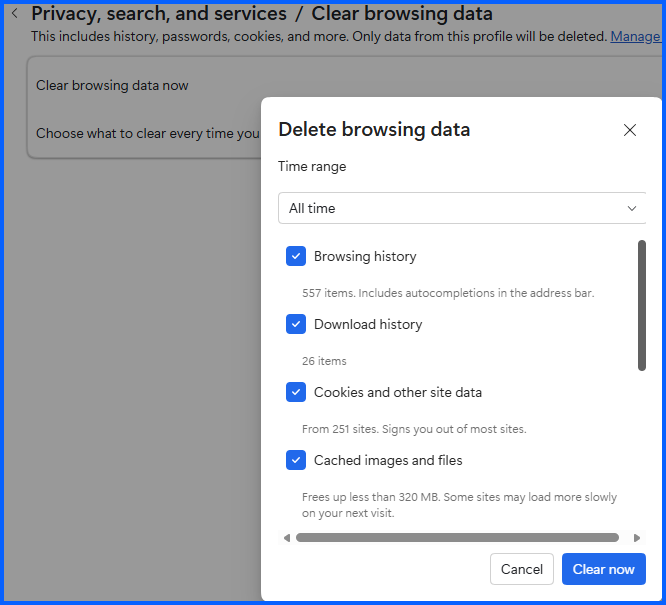

In the **Privacy, search, and services /Clear browsing data** page or **edge://settings/privacy/clearBrowsingData**

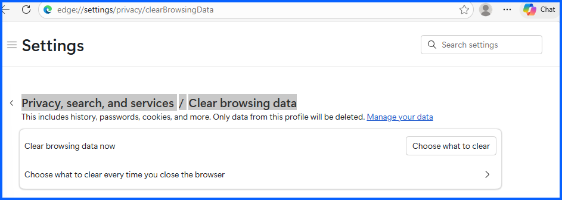

1. Click on **Choose what to clear every time you close the browser**. 

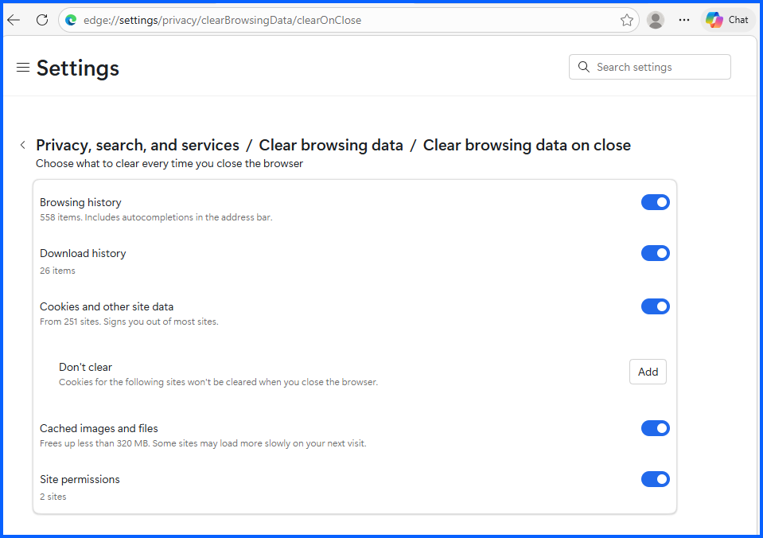

2. Check everything (Do this if if you share your computer with someone)

---

## Step 2: Third-Party Cookie Protection

Go back (click the back logo top left 2x) or go to **edge://settings/privacy**

1. Click on Cookies

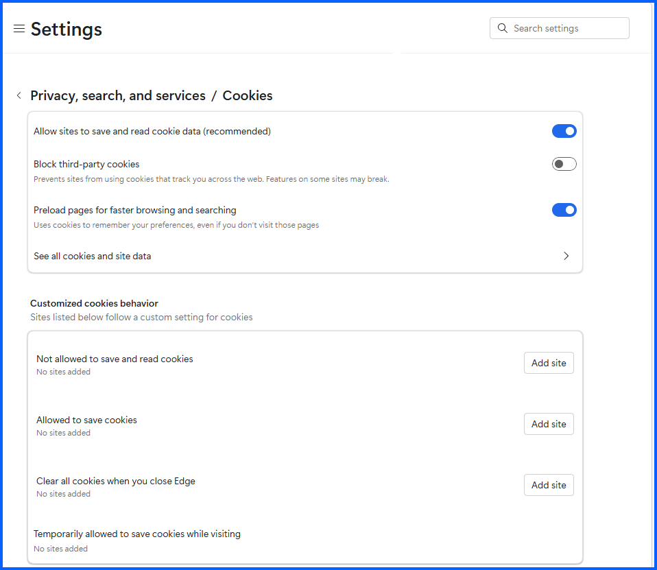

To disable Third party cookies click enable **Block third-party cookies**. They are usually used for tracking, advertising and analytics.

Under Customized cookies behavior you can add:
- **Sites that are not allowed to save and read cookies**
- **Sites that are allowed to save cookies**
- **Clear all cookies when you close Edge**

Note: When clearning browsing data You can clear cookies also.

Click on **See all cookies and site data.**

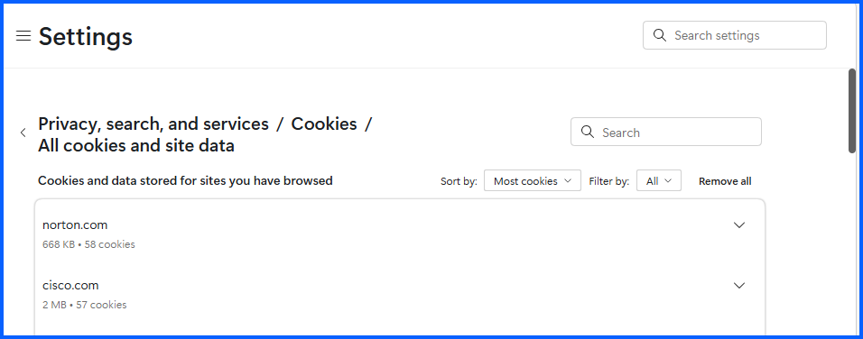

You can click on a site, expand and delete specific cookies

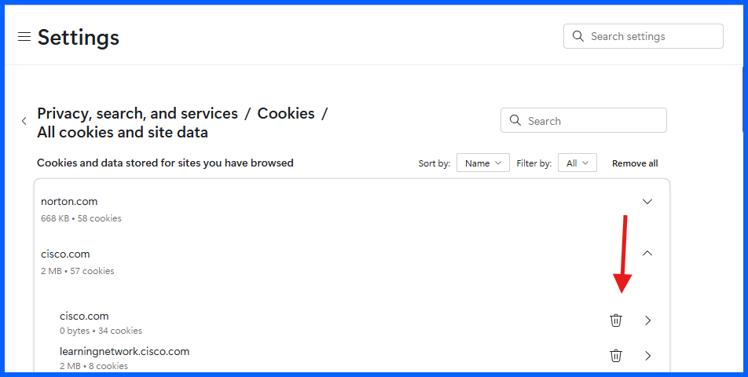

Go back (click back logo 2x) or go to **edge://settings/privacy**

## Step 3: Privacy

1. Click on **Privacy**
2. Enable **Send “Do Not Track” requests**, then click send request
3. You can enable the last two if you want they are for your personalization

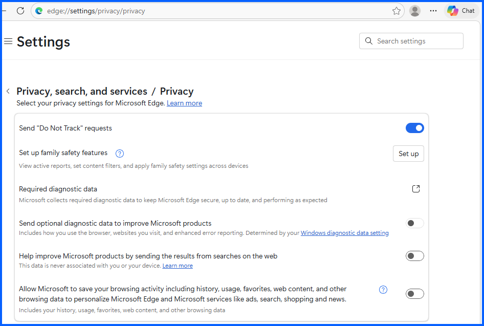

Go back (click back logo)

## Step 4: Security

Click on **Security**

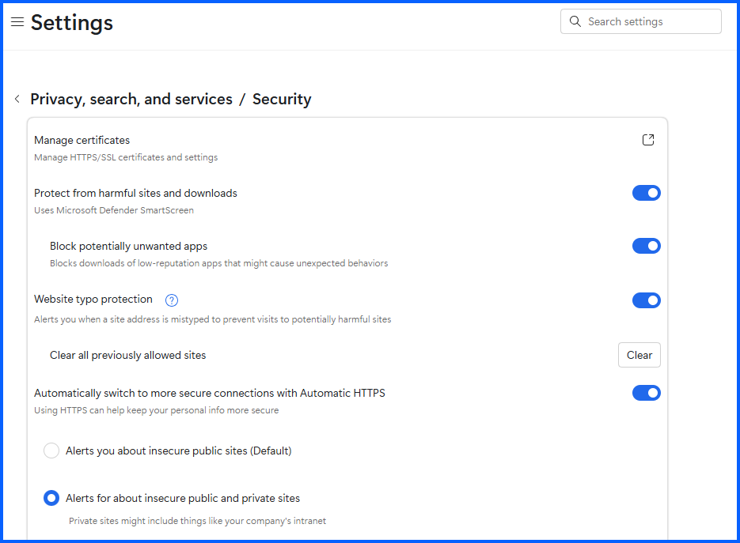

Enable:
- **Protect from harmful sites and downloads**
- **Block potentially unwanted apps**
- **Websites typo protection**
- **Automatically switch to more secure connections with Automatic HTTPS**
- Select **Alerts for about insecure public and private sites**

Note if you have problems download something you can change these settings

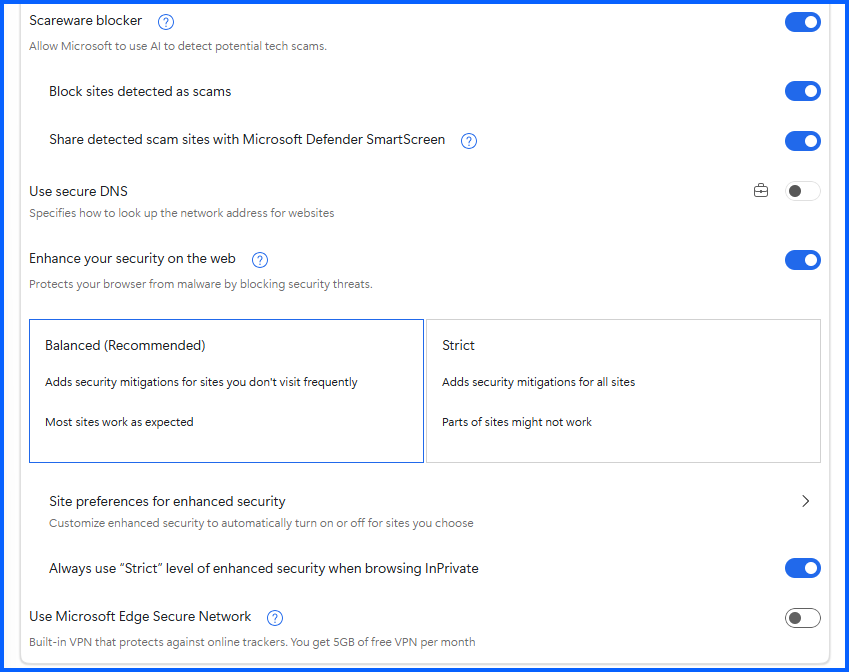

- Enable **Scareware blocker**
- Enable **Block sites detected as scams**
- Enable **Share detection scame sites with Microsoft Defender SmartScreen**
- Enable **Enhanced your security on the web**
  - Under Enhanced your security on the web you can choose **Strict**, just know some sites may not work, if that happens change this setting back to **balanced**.
- Enable Use Microsoft Edge Secure Network
- You can set up Microsoft's **VPN**

- Click on **Site preferences for enhanced security**

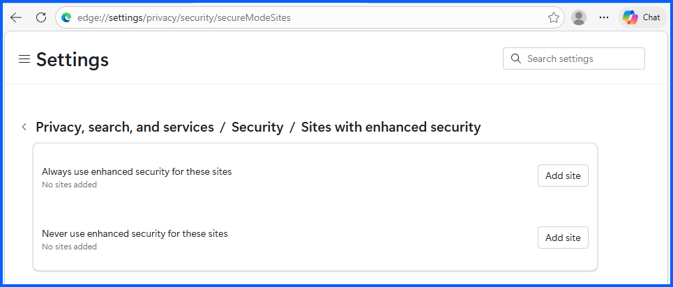

- In **Site preferences for enhance security** you can configure sites to use with enhance security 

## Step 5: Site perminssions

1. Click on Sites permission to view or modify them

## Step 6: Search and connected experiences

In **edge://settings/privacy**

1. Click on **Search and connected experiences**

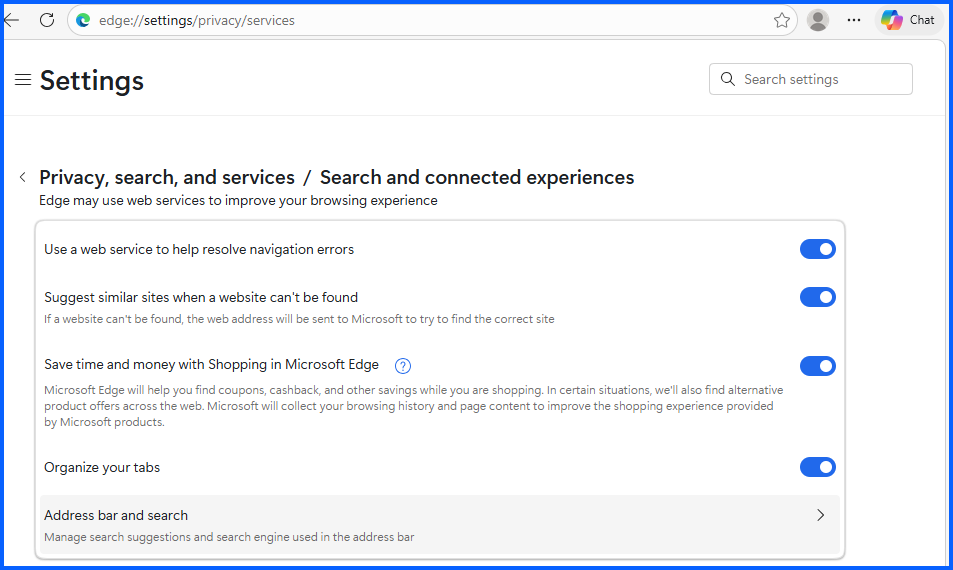

- You can leave all these settings enabled
- Click on **Address bar and search**

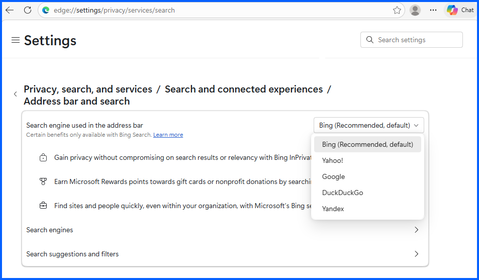

- Here you can change your search engine here

