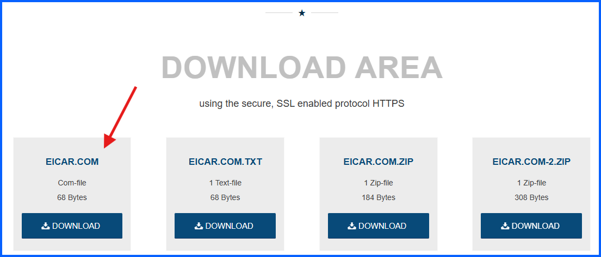
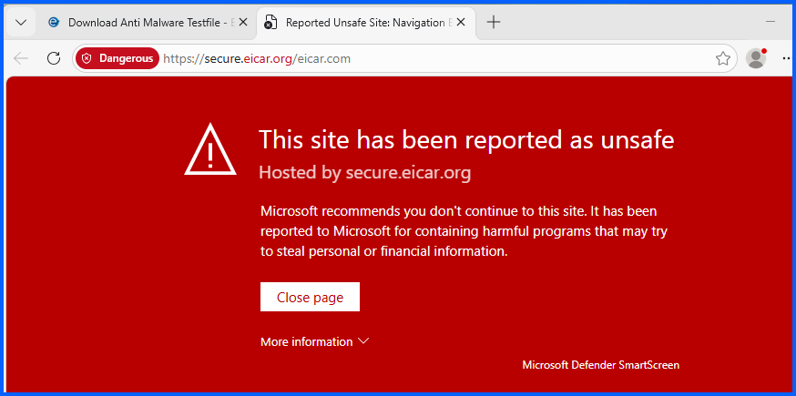

# Endpoint Malware Detection Test (Host Machine)
 
## Overview

This lab demonstrates how endpoint security solutions detect malicious files. The goal of this lab was to verify that the host machine's antivirus protection can successfully detect and prevent the download of a known malware test signature.

The EICAR test file is a harmless test file used by security professionals to validate that antivirus software is functioning correctly. This test simulates a malware download attempt and allows verification that the system's security controls respond appropriately.

---

## Objective

- Verify that endpoint antivirus protection is functioning properly
- Attempt to download a known malware test file
- Observe how the security software responds
- Confirm that the malicious file is blocked before it reaches the system

---

## Tools and Technologies

- Web browser
- Endpoint antivirus protection
- EICAR Anti-Malware Test File

---

## Test Scenario

The EICAR test file is commonly used by security vendors to confirm that antivirus detection mechanisms are working correctly. When the file is downloaded, antivirus software should immediately detect the signature and block the file.

This test simulates a real-world scenario in which a user unknowingly attempts to download a malicious file from the internet.

---

## Step 1 Navigate to the EICAR Test File Website

1. Opened a web browser, search for **eicar test file**
2. Clicked **Download Anti Malware Testfile**


3. Scrolled down



Attempt to download the following file:

```
eicar.com
```

---

## Step 2 Attempt File Download

Clicked **eicar.com** to start the download.

Because the file contains a known malware test signature, the endpoint antivirus protection on the host machine should immediately detect the file and block the download.

### Expected Behavior

- Windows Defender detects the EICAR test signature
- The download is blocked
- A security warning appears



---

## Results

My host machine's antivirus protection (Windows Defender) successfully detected and blocked the EICAR test file during the download attempt.

The file was prevented from being downloaded onto my system, confirming that the endpoint protection is functioning as expected.

---

## Security Analysis

Endpoint security tools monitor file downloads and system activity for known malware signatures and suspicious behavior. When a file containing a recognized threat signature is detected, windows defender blocks the file.

The EICAR test file allows security professionals to safely verify that malware detection systems are operational without exposing systems to real malware.

---

## Next Phase

Because my host machine blocked the malicious file, the next phase of this lab is to test in an isolated environment using Windows Sandbox. This allows the file to be downloaded and analyzed safely without risking the host system.
