# Isolated Malware Testing with Windows Sandbox

## Overview

This lab demonstrates how malware can be safely tested and analyzed in an isolated environment using Windows Sandbox. Because the host machine’s antivirus protection prevents the EICAR test file from being downloaded.

Windows Sandbox provides a temporary virtual machine that is isolated from my host machine. Any files downloaded or executed inside the sandbox are removed once the sandbox is closed.

In this lab, the EICAR anti-malware test file was downloaded within Windows Sandbox and then analyzed using VirusTotal to observe how multiple antivirus engines classify the file.

---

## Objective

- Safely download the malware test file in an isolated environment
- Analyze the file using VirusTotal
- Observe how multiple antivirus vendors classify the file

---

## Tools and Technologies

- Windows Sandbox
- Web browser (Google Chrome)
- VirusTotal
- EICAR Anti-Malware Test File


---

## Step 1 Launch Windows Sandbox

Open the Windows Sandbox application.

1. Click **Start**
2. Search for **Windows Sandbox**
3. Launch the Windows Sandbox environment

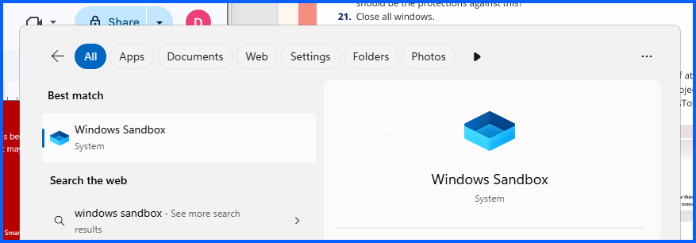

Open up Microsoft Edge and Download Google Chrome

---

## Step 2 Disable Windows Defender Firewall (Inside Sandbox)

Inside the sandbox environment:

1. Click **Start**
2. Search for **Windows Defender Firewall**

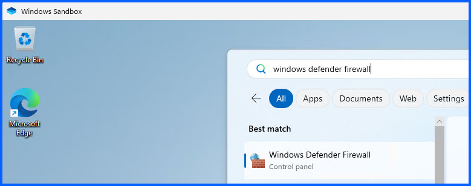

4. Click **Turn Windows Defender Firewall on or off**

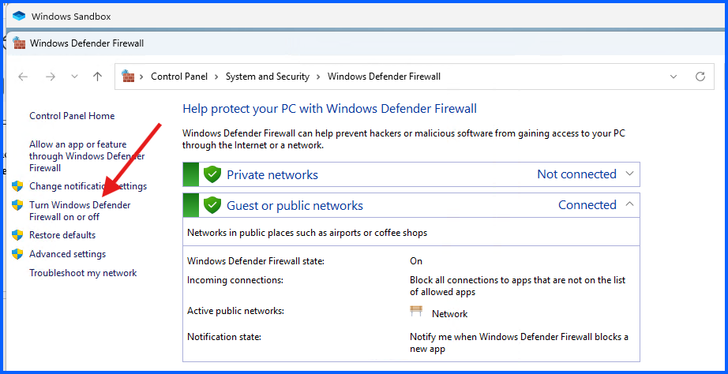

6. Click on **Turn of Windows Defender Firewall**

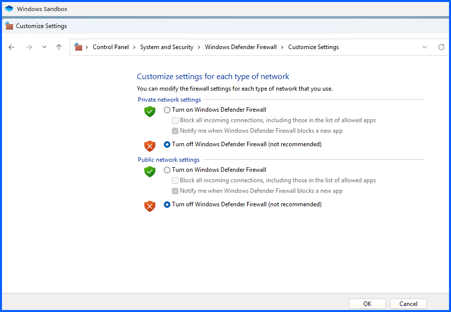
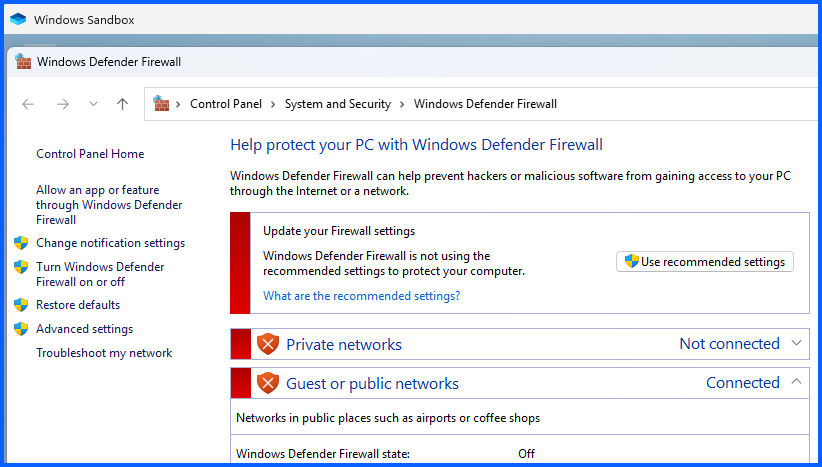


This step allows the test file to be downloaded inside the sandbox.

## Step 3 Download the EICAR Test File

1. Open a Chrome, search for **eicar test file**
2. Click **Download Anti Malware Testfile**

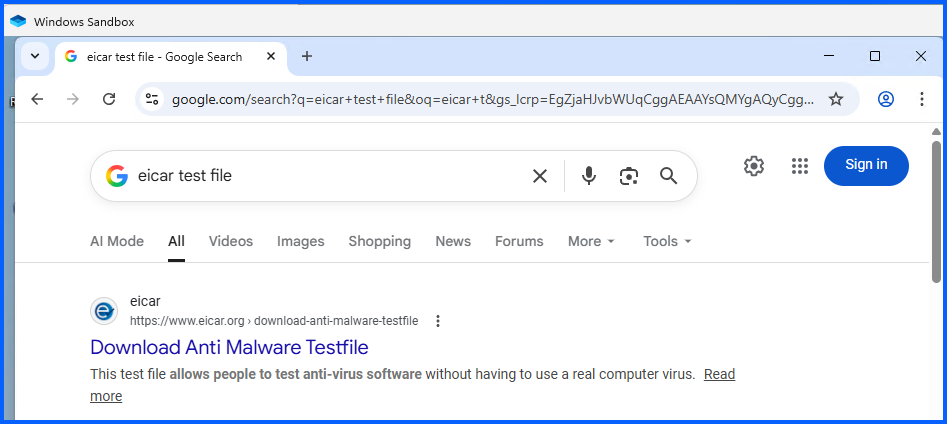

3. Scroll down

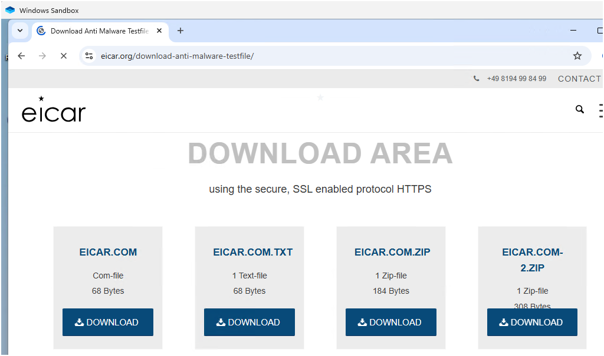

Attempt to download the following file:

```
eicar.com
```

It didn't work. I downloaded **EICAR.COM.ZIP** instead

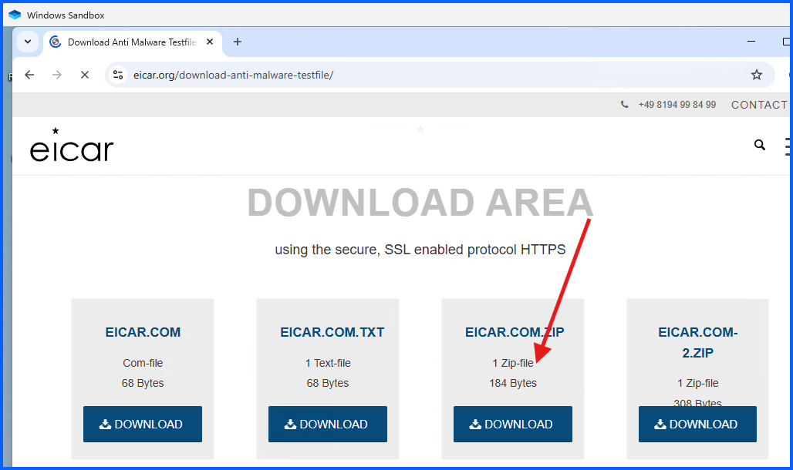

Extract the file after downloading:

1. Navigate to Downloads
2. Right click **eicar_com**
3. Click **Extract All ...**
4. Click **Extract**

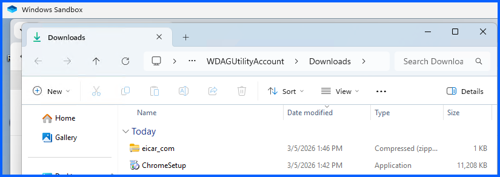
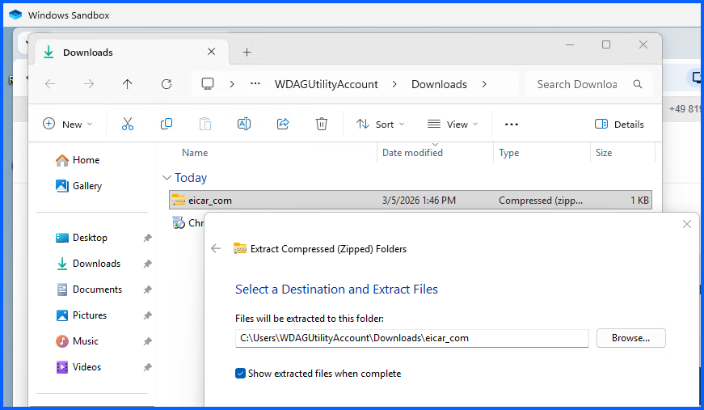

---

## Step 4 Upload the File to VirusTotal

Open a new browser tab and navigate to:

```
https://www.virustotal.com
```

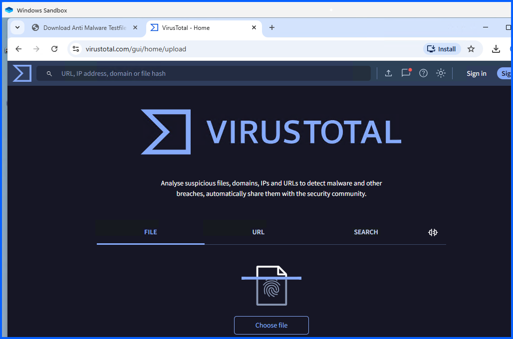

Then:

1. Clicked the **File** tab (If necessary)
2. Selected **Choose File**
3. Navigated to my Downloads, eicar_com, then click on eicar and click Open

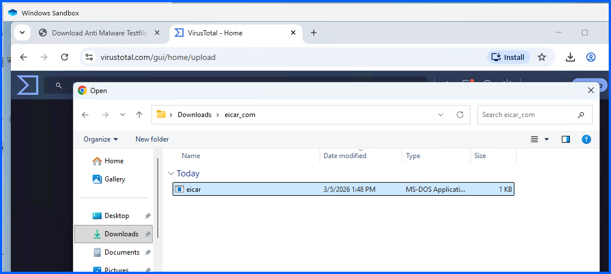

4. It automatically uploaded the file and scanned the file

---

## Step 5 Review Antivirus Detection Results

After the upload completes, VirusTotal scans the file using multiple antivirus engines.

### Results

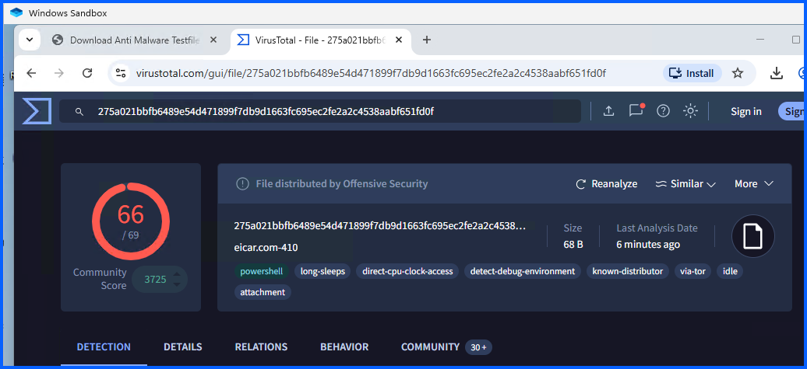
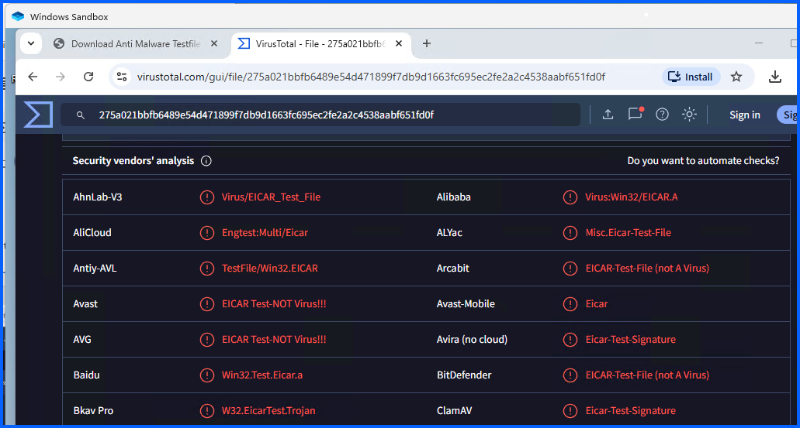

- **66 out of 69 antivirus vendors detected the file as malicious**

This result confirms that the file contains a known malware test signature used by antivirus vendors.

---

## Step 6 Review File Details

Navigateed to the **Details** tab within VirusTotal to review:

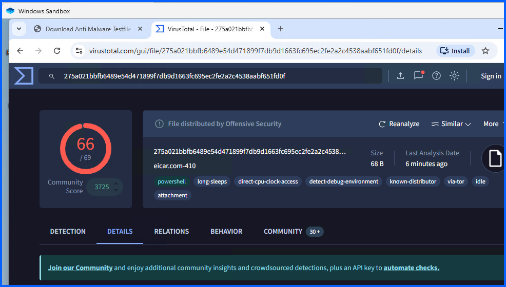
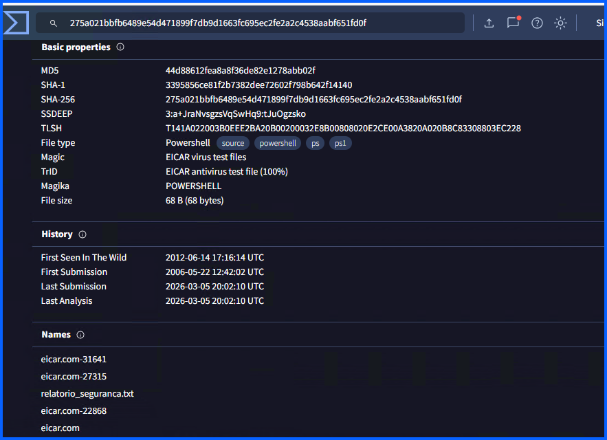

