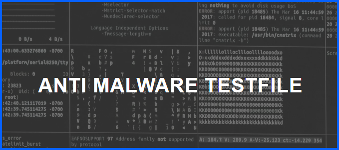

# Malware Detection and Sandbox Analysis

## Overview

This lab/project demonstrates how endpoint security detect malicious files and how suspicious files can be safely analyzed in an isolated environment. The lab simulates a real-world scenario where a potentially malicious file is encountered and must be investigated without compromising the host system.

The testing process occurs in two phases. First, the host machine’s endpoint antivirus protection is tested by attempting to download a known malware test file. After confirming that the system blocks the file, the analysis continues within an isolated environment using Windows Sandbox.

Inside the sandbox, the file is downloaded and analyzed using VirusTotal to observe how multiple antivirus engines classify the file.

---
